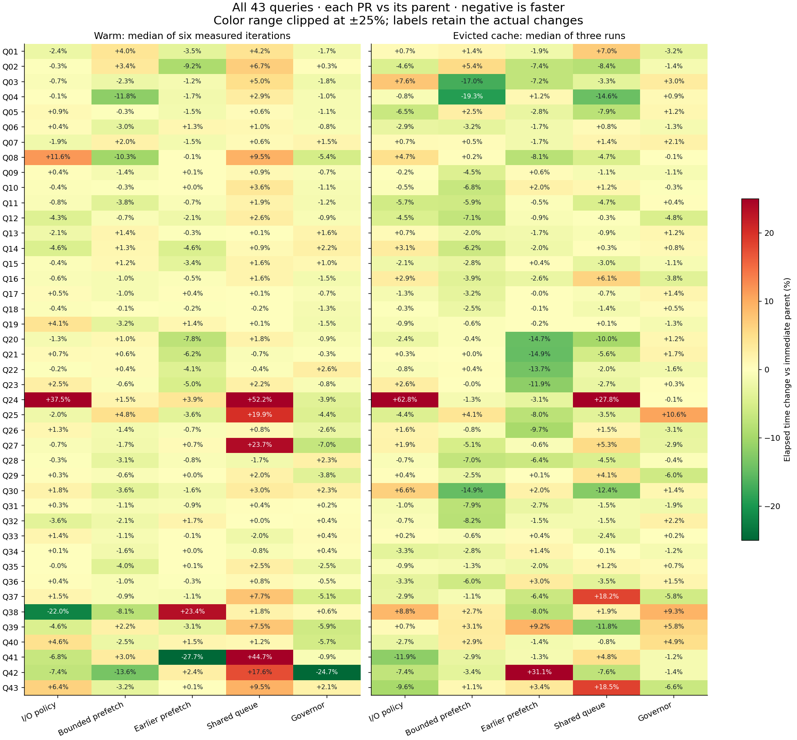

# Full partitioned ClickBench: stacked Parquet I/O PRs

[Keep / defer / drop recommendations](DECISIONS.md) · [Reproduction](REPRODUCE.md) · [Timing data](timings.json) · [CPU profile totals](profile-summary.json)

Open `index.html` locally for the interactive chart selector. On GitHub, use the per-PR chart indexes below. All 43 queries have native CPU charts; Q21, Q29 and Q35 also have evicted-file CPU charts.

- [PR #4: I/O policy](stage1/README.md)
- [PR #5: Bounded prefetch](stage2/README.md)
- [PR #7: Earlier prefetch](stage3/README.md)
- [PR #8: Shared queue](stage4/README.md)
- [PR #9: Memory governor](stage5/README.md)

# Parquet I/O stack: NVMe comparison

Measured on lsa-cupid1 under `/work/peterxcli/datafusion-io-stack-20260916`. Each stage is compared with its immediate parent; negative elapsed-time changes mean faster.

| PR stage | Warm sum of query medians, pass 1 / pass 2 | Evicted-cache sum of query medians |
|---|---:|---:|
| [I/O policy](https://github.com/peterxcli/datafusion/pull/4) | +0.97% / +0.49% | -0.20% |
| [Bounded prefetch](https://github.com/peterxcli/datafusion/pull/5) | -1.86% / -1.22% | -2.33% |
| [Earlier prefetch](https://github.com/peterxcli/datafusion/pull/7) | -0.16% / -0.54% | -2.03% |
| [Shared queue](https://github.com/peterxcli/datafusion/pull/8) | +0.21% / +0.76% | -0.26% |
| [Governor](https://github.com/peterxcli/datafusion/pull/9) | -0.96% / -0.37% | -0.71% |

The run contains 3,516 query executions in 1,602 processes, including warmups and separate profiles. All 43 queries use the complete 100-file dataset: 99,997,497 rows and 14,737,666,736 compressed bytes. File checksums match the previous AWS dataset manifest.

All stages use Rust 1.97.0, the same release profile, timing instrumentation, plan traversal and source cloning, eight Tokio workers, eight scan partitions, and a 12G fair memory pool. Processes and memory are bound to NUMA node 1, CPUs 96–111, where the NVMe device is attached. The full dataset is evicted and then read on NUMA node 1 before profiling and warm timing begin. Warm timings retain two reversed-order passes, each with one excluded warmup and three measured iterations. Cold timings have three one-iteration processes, with dataset-only `POSIX_FADV_DONTNEED` before each. This evicts Linux file pages; it does not clear the SSD's internal cache. All spill files use the same NVMe mount through a task-local `TMPDIR`. Compilation finishes before timing starts.

Additional controls add 8 ms per object-store read call for Q21/Q29 and raise Q35's pool to 20G. These are controls, not measurements of remote storage. Spill counts and query disk-read bytes are retained beside timings. The fixed queue uses 32 jobs / 512 MiB; prefetch uses 64 MiB per stream. The governor comparison changes only its explicit mode.

Native per-process `PERF_RECORD_SWITCH` traces, with the harness's runtime park callbacks disabled, show actual on-CPU intervals, including all eight workers and the runtime's blocking I/O threads. All 43 queries have warm CPU profiles; Q21, Q29, and Q35 additionally have one evicted-cache CPU profile per version. Their wall times are profiled observations, separate from the untraced performance comparison. Off-CPU time includes sleeping and scheduling delay and must not be labeled entirely as I/O wait.

Result comparisons use multisets and floating-point tolerance. 35/43 queries match across every recorded run. Differences from unordered LIMIT or incomplete tie ordering are listed in `result-validation.json`; six known tied-ranking queries additionally compare ordering values. These exceptions are not claimed as exact result equality.

[Open the per-query before/after charts](index.html). The stack branches contain production changes and tests; this report retains benchmark artifacts separately.

## Cumulative change vs fork baseline

| Stage | Warm pass 1 / pass 2 | Evicted cache |
|---|---:|---:|
| I/O policy | +0.97% / +0.49% | -0.20% |
| Bounded prefetch | -0.91% / -0.73% | -2.52% |
| Earlier prefetch | -1.07% / -1.27% | -4.50% |
| Shared queue | -0.86% / -0.52% | -4.75% |
| Governor | -1.82% / -0.88% | -5.43% |

Warm comparisons exceeding 5% in both passes (a consistency screen, not a significance test):

- I/O policy: faster [38]; slower [8, 24]. Geometric-mean time change: -0.05%.
- Bounded prefetch: faster [4, 8, 42]; slower none. Geometric-mean time change: -1.53%.
- Earlier prefetch: faster [20, 21, 41]; slower [38]. Geometric-mean time change: -1.51%.
- Shared queue: faster none; slower [2, 8, 24, 25, 27, 39, 41, 43]. Geometric-mean time change: +5.05%.
- Governor: faster [27, 42]; slower none. Geometric-mean time change: -1.78%.

## Latency and memory controls

| Control | Stage | Median ms | Change vs parent | Spilling measured runs |
|---|---|---:|---:|---:|
| Q21 +8 ms/read | Baseline | 1549.50 | — | 0/6 |
| Q21 +8 ms/read | I/O policy | 1542.25 | -0.47% | 0/6 |
| Q21 +8 ms/read | Bounded prefetch | 1542.24 | -0.00% | 0/6 |
| Q21 +8 ms/read | Earlier prefetch | 1170.76 | -24.09% | 0/6 |
| Q21 +8 ms/read | Shared queue | 936.66 | -20.00% | 0/6 |
| Q21 +8 ms/read | Governor | 930.77 | -0.63% | 0/6 |
| Q29 +8 ms/read | Baseline | 4691.69 | — | 0/6 |
| Q29 +8 ms/read | I/O policy | 4676.63 | -0.32% | 0/6 |
| Q29 +8 ms/read | Bounded prefetch | 4291.59 | -8.23% | 0/6 |
| Q29 +8 ms/read | Earlier prefetch | 4307.67 | +0.37% | 0/6 |
| Q29 +8 ms/read | Shared queue | 4088.19 | -5.10% | 0/6 |
| Q29 +8 ms/read | Governor | 4035.61 | -1.29% | 0/6 |
| Q35 12G | Baseline | 5588.49 | — | 6/6 |
| Q35 12G | I/O policy | 5586.31 | -0.04% | 6/6 |
| Q35 12G | Bounded prefetch | 5360.74 | -4.04% | 5/6 |
| Q35 12G | Earlier prefetch | 5367.44 | +0.13% | 5/6 |
| Q35 12G | Shared queue | 5499.33 | +2.46% | 6/6 |
| Q35 12G | Governor | 5361.50 | -2.51% | 6/6 |
| Q35 20G | Baseline | 2742.42 | — | 0/6 |
| Q35 20G | I/O policy | 2754.06 | +0.42% | 0/6 |
| Q35 20G | Bounded prefetch | 2696.76 | -2.08% | 0/6 |
| Q35 20G | Earlier prefetch | 2734.63 | +1.40% | 0/6 |
| Q35 20G | Shared queue | 2739.04 | +0.16% | 0/6 |
| Q35 20G | Governor | 2717.82 | -0.77% | 0/6 |

## Native CPU observations

These are single profiled observations per query and version, not repeated performance estimates. Worker off-CPU time is summed across eight workers; it includes waiting and scheduling delay.

| Stage | Sum of warm profile wall time (s) | Worker CPU (core-s) | Worker off CPU (core-s) |
|---|---:|---:|---:|
| Baseline | 41.831 | 309.812 | 24.837 |
| I/O policy | 41.907 | 309.256 | 25.997 |
| Bounded prefetch | 41.844 | 313.051 | 21.704 |
| Earlier prefetch | 41.485 | 312.228 | 19.653 |
| Shared queue | 43.511 | 320.027 | 28.063 |
| Governor | 43.314 | 321.516 | 24.999 |

Q19 dominates the queue increase in this single profile pass: its spill volume varies substantially. These observations do not establish a repeatable CPU regression. Repeated untraced timing and spill data remain the performance comparison.

| Q19 profile | Wall ms | Spilled MiB |
|---|---:|---:|
| Baseline | 2749.17 | 79.19 |
| I/O policy | 2658.51 | 0.00 |
| Bounded prefetch | 2749.48 | 98.49 |
| Earlier prefetch | 2684.95 | 56.79 |
| Shared queue | 4767.40 | 1163.03 |
| Governor | 4690.25 | 1788.80 |

Evicted-file CPU profiles confirm physical reads for Q21, Q29 and Q35. Spill variation can dominate these single observations:

| Query | Stage | Profile wall ms | Worker CPU ms | Worker off-CPU ms | Spilled MiB |
|---|---|---:|---:|---:|---:|
| Q21 | Baseline | 1186.42 | 6522.45 | 2968.92 | 0.00 |
| Q21 | I/O policy | 1143.43 | 6150.02 | 2997.42 | 0.00 |
| Q21 | Bounded prefetch | 1158.07 | 6213.04 | 3051.50 | 0.00 |
| Q21 | Earlier prefetch | 1008.85 | 6633.20 | 1437.61 | 0.00 |
| Q21 | Shared queue | 914.41 | 6295.55 | 1019.73 | 0.00 |
| Q21 | Governor | 936.37 | 6439.38 | 1051.55 | 0.00 |
| Q29 | Baseline | 4181.56 | 31230.36 | 2222.08 | 0.00 |
| Q29 | I/O policy | 4204.10 | 31433.18 | 2199.58 | 0.00 |
| Q29 | Bounded prefetch | 4113.40 | 31648.31 | 1258.92 | 0.00 |
| Q29 | Earlier prefetch | 4098.27 | 31861.30 | 924.88 | 0.00 |
| Q29 | Shared queue | 4012.55 | 31279.12 | 821.28 | 0.00 |
| Q29 | Governor | 4251.66 | 31546.46 | 2466.81 | 0.00 |
| Q35 | Baseline | 2902.87 | 20544.99 | 2677.97 | 0.00 |
| Q35 | I/O policy | 5664.37 | 41264.25 | 4050.73 | 3769.83 |
| Q35 | Bounded prefetch | 5360.18 | 40671.47 | 2209.96 | 3735.77 |
| Q35 | Earlier prefetch | 5293.73 | 40824.30 | 1525.57 | 3755.84 |
| Q35 | Shared queue | 5531.36 | 42281.99 | 1968.92 | 3761.83 |
| Q35 | Governor | 5294.65 | 41011.04 | 1346.19 | 3750.48 |
