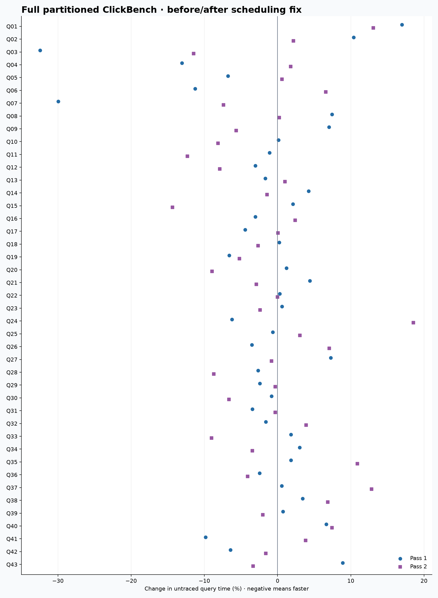
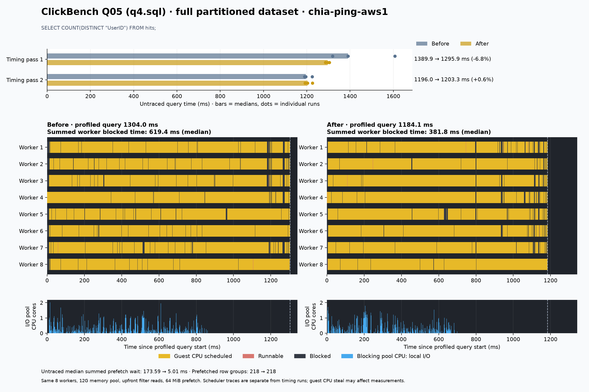

<!---
  Licensed to the Apache Software Foundation (ASF) under one
  or more contributor license agreements.  See the NOTICE file
  distributed with this work for additional information
  regarding copyright ownership.  The ASF licenses this file
  to you under the Apache License, Version 2.0 (the
  "License"); you may not use this file except in compliance
  with the License.  You may obtain a copy of the License at

    http://www.apache.org/licenses/LICENSE-2.0

  Unless required by applicable law or agreed to in writing,
  software distributed under the License is distributed on an
  "AS IS" BASIS, WITHOUT WARRANTIES OR CONDITIONS OF ANY
  KIND, either express or implied.  See the License for the
  specific language governing permissions and limitations
  under the License.
-->

# Full partitioned ClickBench on chia-ping-aws1

All 43 queries completed against all 100 partition files: **99,997,497 rows,
325 row groups, and 14,737,666,736 compressed bytes**. Benchmark execution and
all final chart rendering ran on chia-ping-aws1 on September 12, 2026.

The scheduling fix produces a modest, mixed improvement on this workload.
The sum of per-query timing medians falls **0.06% in pass 1 and 2.04% in pass 2**.
Eleven queries are faster in both passes, seven are slower in both, and 25
change direction. These results do not reproduce the broad speedup seen in
the earlier synthetic wide-scan experiment.

[43-query chart gallery](benchmark-charts/clickbench-full-20260912/index.html) ·
[all timing measurements](benchmark-charts/clickbench-full-20260912/queries.csv) ·
[summary JSON](benchmark-charts/clickbench-full-20260912/summary.json)

The HTML gallery can be opened locally after downloading its directory.
The table below also links directly to every chart on GitHub. Each chart
contains both timing passes and separate before/after CPU and I/O timelines.
Query labels **Q01–Q43** map to the runner's **q0.sql–q42.sql**.

## What is compared

Before is the existing patch at
[`a8f744db6`](https://github.com/peterxcli/datafusion/commit/a8f744db6bf6f147e2ea88fcf03e0f0b977f4683).
After is the scheduling fix at
[`3eaddb5f3`](https://github.com/peterxcli/datafusion/commit/3eaddb5f3f486442b520dcfd65e7a28a39c8707f),
which yields after spawning next-row-group prefetch so the queued read can run.
Both revisions already include the upfront I/O policy and optional prefetch.
This experiment isolates that scheduling change; the
[earlier report](IO_POLICY_BENCHMARK.md) compares the original patch with upstream main.

Both binaries use Rust 1.97.0, the same Cargo.lock, `release-nonlto`, mimalloc,
eight Tokio workers, eight target partitions, a **12G fair memory pool**,
filter pushdown with predicate reordering, `progressive_io=false`, and
**64 MiB prefetch per stream**. Both compile the same benchmark harness.
The host is a KVM Linux 6.8.0-134-generic guest exposing 16 AMD EPYC 7282 vCPUs
and 31 GiB RAM. These are warm local-file reads, without artificial latency
or an OS cache flush. Warmup does not guarantee the entire dataset remains
resident after memory-intensive queries.

The dataset URLs follow the official
[ClickBench DataFusion setup](https://github.com/ClickHouse/ClickBench/tree/main/datafusion).
[File sizes, SHA-256 checksums, and Parquet footer counts](benchmark-charts/clickbench-full-20260912/dataset-manifest.json)
verify all 100 files. Q01 independently returns the full row count on both revisions.
[Query SQL and checksums](benchmark-charts/clickbench-full-20260912/queries-manifest.json) preserve the 43 queries
from the pinned DataFusion ClickBench runner, including its normal hits view
and date/string registration behavior.

## Timing results

Each query/revision process runs one excluded warmup and three measured
iterations. Pass 1 runs before then after in query order; pass 2 reverses both
query and revision order. This gives **688 timing executions, 516 measured**.
Queries run one at a time, without concurrent compilation or scheduler recording.
The timer covers planning and result collection; result validation and metric
capture happen afterward.

| Sum of 43 per-query medians |   Before |    After | Change |
| --------------------------- | -------: | -------: | -----: |
| Pass 1                      | 81.947 s | 81.900 s | -0.06% |
| Pass 2                      | 83.694 s | 81.990 s | -2.04% |

These sums are a workload summary, not an official ClickBench score or one
continuous query. Three measured runs per case and two orderings do not
establish confidence intervals. Host-wide CPU steal during timing processes
has a **4.45% median and 9.79% maximum**.

Q33, Q34, and Q35 spill approximately **3.6–4.2 GiB** under the 12G memory cap.
Their charts therefore include aggregation/sort spill work as well as scan I/O.
Q35 is slower in both passes (+1.8% and +10.9%); that regression remains visible
in the aggregate instead of being excluded.



## Does CPU and I/O overlap improve?

Separate Linux scheduler recordings cover every query/revision, again with one
warmup and three measured iterations: **344 profiled executions, 258 measured**.
Together with the timings, all **1,032 executions** completed successfully.

Summing the per-query medians from those recordings gives:

| Guest worker metric                  |    Before |     After |
| ------------------------------------ | --------: | --------: |
| Blocked time, summed across workers  |  50.513 s |  47.514 s |
| Running time, summed across workers  | 642.669 s | 638.352 s |
| Runnable time, summed across workers |   1.012 s |   0.932 s |
| Query wall time                      |  86.807 s |  86.393 s |

Summed worker-blocked time is **5.94% lower**, so the profiles show some progress
toward keeping query workers busy. The timing runs show that this does not
translate into a uniform query speedup. These are sums of medians across
43 separate profiles; independent state medians need not add to the median
total. They do not measure physical-host idle CPU time.

For Q05, `COUNT(DISTINCT UserID)`, median summed prefetch wait falls from
173.59 ms to 5.01 ms across untraced measurements, with 218 prefetched row groups
in both revisions. Profiled worker-blocked time falls from 619.4 ms to 381.8 ms.
However, the untraced timing improvement changes from 6.8% faster in pass 1
to 0.6% slower in pass 2.



Q29 also reduces first-pass summed prefetch wait from 827.69 ms to 5.92 ms,
while reading the same 2,230,272,811 Parquet bytes and prefetching 218 row groups.
Its timing improves only 2.4% and 0.3%. Q21 retains substantial prefetch wait
(827.23 ms to 765.15 ms in pass 1), and its timing changes direction between
passes. This identifies remaining work without treating every waiting interval
as something the scheduling yield can remove.

With eight partitions, I/O-pool CPU already overlaps at least one running query
worker for almost all its duration in most queries before the fix. That metric
alone hides waiting within individual streams. The per-worker timelines and
summed blocked times provide the more useful comparison here.

Each timeline shows the measured iteration nearest its recording's median wall
time, using equal before/after time and I/O scales. Timing bars come from
separate untraced runs. Gold means scheduled on a guest CPU, red means runnable,
and gray means blocked. Blue sums CPU execution in Tokio's blocking pool,
including local reads and spill I/O. It is not physical disk latency or a count
of Parquet requests. Guest scheduled time may include hypervisor steal.

Workers are identified by actual Tokio park/unpark callbacks matched to process
and thread IDs. The parser checks eight workers, complete query-window coverage,
and no lost perf records. Query and scheduler clocks use before/after
realtime-to-`CLOCK_MONOTONIC` calibration; maximum observed offset drift is 25 ns.
Filtered per-query timeline JSON is linked beside each chart. Raw system-wide
perf records remain on the benchmark host.

## Result checks and limitations

Every query returns the same row count and column types across all 24 of its
executions. **35 queries return matching result multisets**, allowing 1e-12
relative/absolute tolerance for floating-point values. Eight queries return
different rows where their SQL leaves result membership underdetermined:

- Q18 has `LIMIT 10` without `ORDER BY`; Q25 orders by an unprojected EventTime
  without a tie breaker. Only row count and schema agreement are established
  for these two queries; this run does not prove full value equivalence.
- Q32, Q33, Q39, Q40, Q41, and Q42 select different members tied at the ordering
  boundary. Their returned ordering-count sequences match in every execution.

The [validation record](benchmark-charts/clickbench-full-20260912/result-validation.json) retains the reference
rows and all differences. This is comparison between revisions, not an
independent correctness oracle for every query. Dynamic filtering, TopK pruning,
and spills can also change scan or prefetch counters while final results agree.

This run does not establish cold-cache, S3, or Spark performance. It also does
not settle [issue #24393](https://github.com/apache/datafusion/issues/24393):
that issue asks for filter evaluation and the within-row-group I/O policy to
be independent, including a default-policy decision. Both sides here already
use upfront I/O. A full comparison of pushdown/progressive/prefetch combinations
against upstream and storage-level request measurements remains needed to
support that broader claim.

## Every query

All elapsed times are milliseconds. Each cell shows before → after medians;
negative change means faster. Follow a query link for its timing and CPU/I/O chart.

| Query / source file                                                |         Pass 1 (ms) |  Change |         Pass 2 (ms) |  Change |
| ------------------------------------------------------------------ | ------------------: | ------: | ------------------: | ------: |
| [Q01 / q0.sql](benchmark-charts/clickbench-full-20260912/q00.png)  |         3.04 → 3.56 | +16.98% |         3.02 → 3.42 | +13.08% |
| [Q02 / q1.sql](benchmark-charts/clickbench-full-20260912/q01.png)  |       42.39 → 46.80 | +10.39% |       42.09 → 43.01 |  +2.17% |
| [Q03 / q2.sql](benchmark-charts/clickbench-full-20260912/q02.png)  |     182.11 → 123.04 | -32.44% |     126.04 → 111.59 | -11.46% |
| [Q04 / q3.sql](benchmark-charts/clickbench-full-20260912/q03.png)  |     147.76 → 128.44 | -13.07% |     127.53 → 129.83 |  +1.80% |
| [Q05 / q4.sql](benchmark-charts/clickbench-full-20260912/q04.png)  |   1389.91 → 1295.94 |  -6.76% |   1195.95 → 1203.32 |  +0.62% |
| [Q06 / q5.sql](benchmark-charts/clickbench-full-20260912/q05.png)  |   1172.97 → 1040.70 | -11.28% |   1012.72 → 1079.33 |  +6.58% |
| [Q07 / q6.sql](benchmark-charts/clickbench-full-20260912/q06.png)  |         4.41 → 3.09 | -29.95% |         3.17 → 2.94 |  -7.38% |
| [Q08 / q7.sql](benchmark-charts/clickbench-full-20260912/q07.png)  |       52.88 → 56.80 |  +7.42% |       53.27 → 53.39 |  +0.22% |
| [Q09 / q8.sql](benchmark-charts/clickbench-full-20260912/q08.png)  |   1471.84 → 1575.23 |  +7.02% |   1537.28 → 1450.34 |  -5.66% |
| [Q10 / q9.sql](benchmark-charts/clickbench-full-20260912/q09.png)  |   1727.87 → 1729.79 |  +0.11% |   1694.63 → 1556.50 |  -8.15% |
| [Q11 / q10.sql](benchmark-charts/clickbench-full-20260912/q10.png) |     389.09 → 384.78 |  -1.11% |     426.28 → 373.84 | -12.30% |
| [Q12 / q11.sql](benchmark-charts/clickbench-full-20260912/q11.png) |     445.82 → 432.27 |  -3.04% |     435.77 → 401.37 |  -7.89% |
| [Q13 / q12.sql](benchmark-charts/clickbench-full-20260912/q12.png) |   1208.87 → 1188.41 |  -1.69% |   1145.58 → 1157.32 |  +1.02% |
| [Q14 / q13.sql](benchmark-charts/clickbench-full-20260912/q13.png) |   1659.16 → 1729.72 |  +4.25% |   1667.80 → 1643.95 |  -1.43% |
| [Q15 / q14.sql](benchmark-charts/clickbench-full-20260912/q14.png) |   1166.88 → 1191.48 |  +2.11% |   1400.49 → 1199.67 | -14.34% |
| [Q16 / q15.sql](benchmark-charts/clickbench-full-20260912/q15.png) |   1386.00 → 1343.90 |  -3.04% |   1354.63 → 1387.31 |  +2.41% |
| [Q17 / q16.sql](benchmark-charts/clickbench-full-20260912/q16.png) |   2515.70 → 2404.66 |  -4.41% |   2659.07 → 2660.29 |  +0.05% |
| [Q18 / q17.sql](benchmark-charts/clickbench-full-20260912/q17.png) |   2532.34 → 2537.73 |  +0.21% |   2581.94 → 2512.76 |  -2.68% |
| [Q19 / q18.sql](benchmark-charts/clickbench-full-20260912/q18.png) |   5310.45 → 4960.40 |  -6.59% |   5457.76 → 5173.37 |  -5.21% |
| [Q20 / q19.sql](benchmark-charts/clickbench-full-20260912/q19.png) |     134.55 → 136.18 |  +1.21% |     135.43 → 123.29 |  -8.97% |
| [Q21 / q20.sql](benchmark-charts/clickbench-full-20260912/q20.png) |   1470.94 → 1535.67 |  +4.40% |   1505.51 → 1461.89 |  -2.90% |
| [Q22 / q21.sql](benchmark-charts/clickbench-full-20260912/q21.png) |   1692.32 → 1697.08 |  +0.28% |   1813.83 → 1813.40 |  -0.02% |
| [Q23 / q22.sql](benchmark-charts/clickbench-full-20260912/q22.png) |   2900.47 → 2918.16 |  +0.61% |   2788.60 → 2721.57 |  -2.40% |
| [Q24 / q23.sql](benchmark-charts/clickbench-full-20260912/q23.png) |     363.22 → 340.59 |  -6.23% |     325.94 → 386.40 | +18.55% |
| [Q25 / q24.sql](benchmark-charts/clickbench-full-20260912/q24.png) |       95.91 → 95.29 |  -0.64% |       90.49 → 93.24 |  +3.04% |
| [Q26 / q25.sql](benchmark-charts/clickbench-full-20260912/q25.png) |     497.06 → 479.66 |  -3.50% |     457.09 → 489.36 |  +7.06% |
| [Q27 / q26.sql](benchmark-charts/clickbench-full-20260912/q26.png) |     132.41 → 142.00 |  +7.25% |     137.38 → 136.26 |  -0.82% |
| [Q28 / q27.sql](benchmark-charts/clickbench-full-20260912/q27.png) |   1604.46 → 1561.59 |  -2.67% |   1580.22 → 1442.62 |  -8.71% |
| [Q29 / q28.sql](benchmark-charts/clickbench-full-20260912/q28.png) |   7950.48 → 7757.44 |  -2.43% |   7655.07 → 7630.49 |  -0.32% |
| [Q30 / q29.sql](benchmark-charts/clickbench-full-20260912/q29.png) |     120.04 → 119.05 |  -0.82% |     214.13 → 199.92 |  -6.63% |
| [Q31 / q30.sql](benchmark-charts/clickbench-full-20260912/q30.png) |   1050.97 → 1014.89 |  -3.43% |   1184.28 → 1180.41 |  -0.33% |
| [Q32 / q31.sql](benchmark-charts/clickbench-full-20260912/q31.png) |   1043.93 → 1027.22 |  -1.60% |   1026.01 → 1065.99 |  +3.90% |
| [Q33 / q32.sql](benchmark-charts/clickbench-full-20260912/q32.png) | 15698.66 → 15983.75 |  +1.82% | 17130.18 → 15586.50 |  -9.01% |
| [Q34 / q33.sql](benchmark-charts/clickbench-full-20260912/q33.png) | 11392.31 → 11734.83 |  +3.01% | 11752.93 → 11349.41 |  -3.43% |
| [Q35 / q34.sql](benchmark-charts/clickbench-full-20260912/q34.png) | 11264.82 → 11469.09 |  +1.81% | 11136.95 → 12349.38 | +10.89% |
| [Q36 / q35.sql](benchmark-charts/clickbench-full-20260912/q35.png) |   1166.78 → 1137.95 |  -2.47% |   1282.73 → 1230.38 |  -4.08% |
| [Q37 / q36.sql](benchmark-charts/clickbench-full-20260912/q36.png) |     117.98 → 118.65 |  +0.56% |     116.49 → 131.44 | +12.83% |
| [Q38 / q37.sql](benchmark-charts/clickbench-full-20260912/q37.png) |       62.15 → 64.28 |  +3.42% |       60.70 → 64.87 |  +6.86% |
| [Q39 / q38.sql](benchmark-charts/clickbench-full-20260912/q38.png) |       60.56 → 61.01 |  +0.75% |       60.78 → 59.56 |  -2.01% |
| [Q40 / q39.sql](benchmark-charts/clickbench-full-20260912/q39.png) |     217.12 → 231.55 |  +6.65% |     216.76 → 232.89 |  +7.45% |
| [Q41 / q40.sql](benchmark-charts/clickbench-full-20260912/q40.png) |       38.09 → 34.34 |  -9.84% |       33.71 → 35.00 |  +3.81% |
| [Q42 / q41.sql](benchmark-charts/clickbench-full-20260912/q41.png) |       33.65 → 31.48 |  -6.44% |       32.65 → 32.12 |  -1.61% |
| [Q43 / q42.sql](benchmark-charts/clickbench-full-20260912/q42.png) |       28.53 → 31.07 |  +8.89% |       31.33 → 30.28 |  -3.34% |

## Reproduction and artifacts

The complete run is retained on chia-ping-aws1 at
`/home/ubuntu/oss/datafusion-clickbench-full-20260912`: inputs, paired binaries,
harness sources, timing records, native records, validation, and chart scripts.
The isolated source checkout is
`/home/ubuntu/oss/datafusion-io-overlap-20260912`.

```bash
cd /home/ubuntu/oss/datafusion-clickbench-full-20260912
# Completed cases are reused; change script results paths for a fresh run.
bash run_all.sh
/home/ubuntu/oss/datafusion-io-overlap-results-20260912/venv/bin/python plot_queries.py
```

`build.sh` builds both pinned revisions with the same `clickbench.rs` and
`clickbench_overlap.rs` harness. `download.sh` and `verify_data.py` obtain and
check the full dataset. `run_queries.py` performs the two timing passes;
`record_native.py` records each query/revision separately. `check_results.py`
compares returned values, and `check_native_parser.py` checks scheduler parsing,
including worker names assigned out of creation order. `plot_queries.py`
generates all 43 charts, the overview, CSV, and HTML gallery from saved records.
The downloadable results archive contains these scripts and benchmark records;
large inputs, binaries, and system-wide traces remain on the host.
