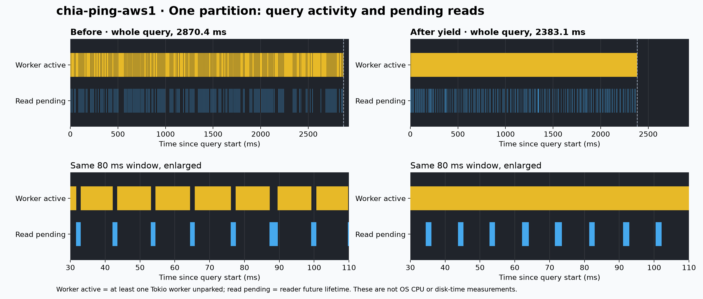
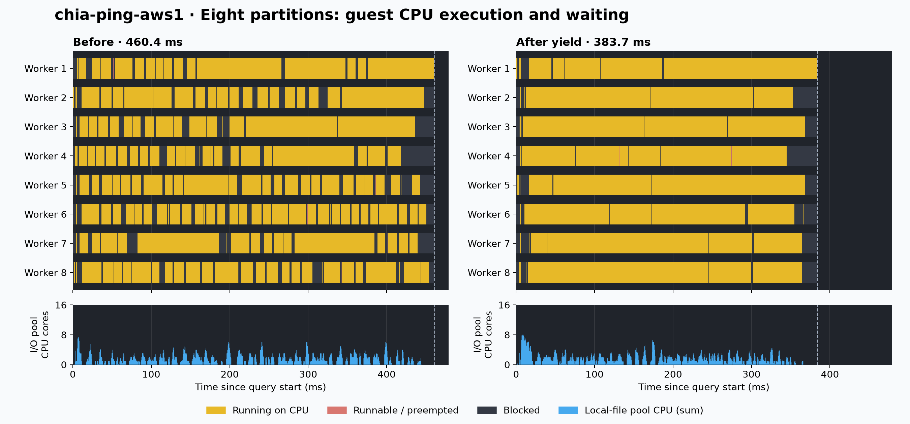
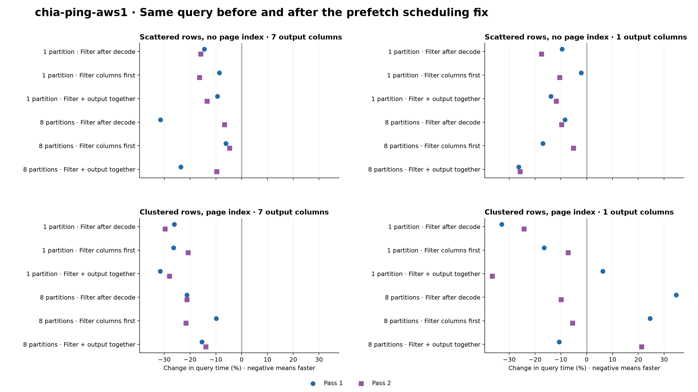

<!---
  Licensed to the Apache Software Foundation (ASF) under one
  or more contributor license agreements.  See the NOTICE file
  distributed with this work for additional information
  regarding copyright ownership.  The ASF licenses this file
  to you under the Apache License, Version 2.0 (the
  "License"); you may not use this file except in compliance
  with the License.  You may obtain a copy of the License at

    http://www.apache.org/licenses/LICENSE-2.0

  Unless required by applicable law or agreed to in writing,
  software distributed under the License is distributed on an
  "AS IS" BASIS, WITHOUT WARRANTIES OR CONDITIONS OF ANY
  KIND, either express or implied.  See the License for the
  specific language governing permissions and limitations
  under the License.
-->

# CPU and I/O overlap on chia-ping-aws1

The September 12 run reproduces the scheduling improvement on Linux. With one
scan partition, the old patch spends about 426 ms with every query worker
parked; the yield reduces this to 1.9 ms. Linux scheduler events independently
show local-file I/O CPU work moving from almost no overlap with query workers
to 99.6% overlap. Query-worker CPU time is essentially unchanged. The work is
happening concurrently, and the query finishes earlier.

The subsequent [full partitioned ClickBench run](CLICKBENCH_FULL_PROFILING.md)
contains 43 before/after query charts and shows a smaller, mixed timing benefit.

## Comparison and controls

Both binaries ran on `chia-ping-aws1` (`peterxcli-ubuntu`): an x86_64 KVM guest
with 16 vCPUs exposed as AMD EPYC 7282, 31 GiB RAM, and Linux 6.8.0-134-generic.
Both used pinned Rust 1.97.0, `release-nonlto`, the same Cargo.lock, and the exact
same [whole-query harness](../../benchmarks/examples/io_overlap.rs).

The baseline is the existing patch at
[`a8f744db6`](https://github.com/peterxcli/datafusion/commit/a8f744db6bf6f147e2ea88fcf03e0f0b977f4683).
The after binary is
[`3eaddb5f3`](https://github.com/peterxcli/datafusion/commit/3eaddb5f3f486442b520dcfd65e7a28a39c8707f),
which adds the five-line scheduling yield. This compares the current patch
before and after that fix; the [earlier baseline report](IO_POLICY_BENCHMARK.md)
compares the original patch with upstream main.

The [previous profiling report](IO_OVERLAP_PROFILING.md) describes the SQL and
fixture generator. Each fixture contains 33,554,432 rows in 256 row groups,
eight Int64 columns, Snappy compression, and 2 GiB of logical values. The exact
same files were copied from the local experiment and verified by SHA-256:

```text
scan-false-false-256.parquet  78cd3fbe2728050055171ff4affc0c50e313464222b5dda7509aa12c67cd0a8d
scan-true-true-256.parquet    75b53d123f54bd2d17832f1c8992c9a71953fc7f56d162ebaff7ca4cee0c9199
```

There are 24 cases: scattered/no-index or clustered/indexed rows, one or seven
output columns, one or eight partitions, and three reading modes. All use eight
Tokio workers and 16 MiB prefetch per stream. Each process runs one warmup and
three measured queries. Pass 2 reverses both case order and before/after order.
All **384 executions** checked independently expected counts and checksums;
paired runs also had identical requested bytes, prefetched bytes, prefetched row
groups, and budget skips. There were 288 measured executions after warmups.

These are warm local-file reads without artificial latency. Timing runs had no
tracing or concurrent builds. The VM's aggregate CPU steal during benchmark
processes had a median of 8.0% and a maximum of 18.6%. The two passes expose
variation; they do not establish confidence intervals or performance on S3.

## CPU and I/O timelines



The runtime trace for scattered rows, seven output columns, one partition,
and filtering after decode gives these medians over three measured queries:

| Runtime metric                                 |     Before |      After |
| ---------------------------------------------- | ---------: | ---------: |
| Read-pending time overlapping an active worker |      4.20% |     99.65% |
| Wall time with all eight workers parked        |  426.01 ms |    1.89 ms |
| All workers parked while a read was pending    |  425.58 ms |    1.56 ms |
| Summed reader-future lifetime                  |  446.23 ms |  448.09 ms |
| Profiled query wall time                       | 2870.42 ms | 2383.12 ms |

An active worker is unparked by Tokio; it may still be preempted by the OS.
A pending read is a reader future's lifetime, including scheduling and wakeup.
The enlarged window shows reads overlapping query activity after the fix.
With prefetch disabled, the same control still has 418/434 ms of all-worker
parked time before/after. The improvement depends on the prefetch path.

A separate Linux `perf` recording confirms actual guest scheduler overlap for
the same single-partition query:

| Native metric, median of three measured queries          |     Before |      After |
| -------------------------------------------------------- | ---------: | ---------: |
| I/O-pool running time overlapping a running query worker |     0.026% |    99.643% |
| Summed query-worker running time                         | 2485.72 ms | 2482.72 ms |
| Summed I/O-pool running time                             |  437.39 ms |  457.05 ms |
| Profiled query wall time                                 | 2908.32 ms | 2446.64 ms |

The I/O CPU overlap percentage is weighted by each I/O thread's running time.
It measures local-file pool work, not physical disk latency. CPU steal was
0.33%/0.68% during these recordings. One partition supplies roughly one worker's
worth of query work; the other seven workers need not become busy.



For eight partitions, medians over 15 measured queries are:

| Native metric               |     Before |      After |
| --------------------------- | ---------: | ---------: |
| Summed worker blocked time  |  749.33 ms |  283.60 ms |
| Summed worker running time  | 2951.73 ms | 2822.82 ms |
| Summed worker runnable time |    5.82 ms |    1.68 ms |
| Profiled query wall time    |  460.43 ms |  383.71 ms |

Blocked time falls **62%**. Both revisions already overlap almost all I/O-pool
CPU time with at least one worker (99.5%/98.7%); the change reduces waiting
within individual scan streams. Each plot uses the query nearest its recording's
median elapsed time and the same horizontal scale. Medians of individual
metrics need not add up to the median total. CPU steal was 7.01%/5.92% during
these recordings, so their 16.7% latency reduction is not an isolated estimate
of the fix's effect.

Worker roles come from actual Tokio park/unpark callbacks matched to process
and thread IDs, rather than thread creation order. The parser checks all eight
workers, full query-window coverage, and absence of lost perf records; its
regression check includes out-of-order worker names. Scheduler and query clocks
are aligned through `CLOCK_MONOTONIC`/realtime calibration before and after
each recording, with less than 20 ns offset drift. Guest `Running` can include
hypervisor steal time, so these are guest scheduler states, not physical-host
CPU utilization measurements.

[Filtered timeline data](benchmark-charts/aws-20260912/io-overlap-timeline.json)
contains benchmark intervals and per-query summaries. Raw system-wide scheduler
records stay on the benchmark host. Native profiles and runtime traces are
separate from the untraced timing runs.

## Untraced query times



Scattered-row wide queries used **9–16% less elapsed time with one partition**
across reading modes and both passes. Eight-partition wide progressive queries
used 6.1%/4.7% less time; upfront queries used 23.5%/9.6% less. For the wide
single-partition query without pushdown, prefetch wait fell from 463.5/456.0 ms
to 1.60/1.45 ms across the two passes.

Short indexed queries remain mixed. The narrow eight-partition query without
pushdown changed from 34.7% slower to 9.9% faster between passes; narrow upfront
changed from 10.7% faster to 21.3% slower. These results support the scheduling
fix for the measured long scans, but do not justify a universal speedup or a
change to the default prefetch setting.

`off` filters after decode; `progressive` reads filter columns before output
columns; `upfront` reads both sets of selected pages together. Prefetch is on
in every row. Values below are medians excluding iteration zero; negative
changes mean less elapsed time. Distribution and page-index availability vary
together and cannot be evaluated independently with these two fixtures.

| Distribution / index | Output columns | Partitions | Mode        | Before 1 (ms) | After 1 (ms) | Change 1 | Before 2 (ms) | After 2 (ms) | Change 2 |
| -------------------- | -------------: | ---------: | ----------- | ------------: | -----------: | -------: | ------------: | -----------: | -------: |
| random               |              7 |          1 | off         |       2953.13 |      2525.91 |   -14.5% |       2842.66 |      2390.69 |   -15.9% |
| random               |              7 |          1 | progressive |       2816.53 |      2572.89 |    -8.7% |       2927.42 |      2448.01 |   -16.4% |
| random               |              7 |          1 | upfront     |       2818.31 |      2552.61 |    -9.4% |       2899.45 |      2510.80 |   -13.4% |
| random               |              7 |          8 | off         |        626.42 |       429.55 |   -31.4% |        452.00 |       421.77 |    -6.7% |
| random               |              7 |          8 | progressive |        462.83 |       434.51 |    -6.1% |        443.83 |       422.86 |    -4.7% |
| random               |              7 |          8 | upfront     |        540.24 |       413.05 |   -23.5% |        440.30 |       397.86 |    -9.6% |
| random               |              1 |          1 | off         |        804.82 |       727.86 |    -9.6% |        826.51 |       681.61 |   -17.5% |
| random               |              1 |          1 | progressive |        763.81 |       747.69 |    -2.1% |        885.58 |       792.44 |   -10.5% |
| random               |              1 |          1 | upfront     |        860.02 |       741.11 |   -13.8% |        809.91 |       714.73 |   -11.8% |
| random               |              1 |          8 | off         |        146.15 |       133.81 |    -8.4% |        135.88 |       122.71 |    -9.7% |
| random               |              1 |          8 | progressive |        150.30 |       124.84 |   -16.9% |        139.08 |       131.93 |    -5.1% |
| random               |              1 |          8 | upfront     |        162.35 |       119.61 |   -26.3% |        165.34 |       122.73 |   -25.8% |
| clustered            |              7 |          1 | off         |        102.79 |        75.90 |   -26.2% |        137.55 |        96.66 |   -29.7% |
| clustered            |              7 |          1 | progressive |        116.31 |        85.64 |   -26.4% |        107.40 |        85.11 |   -20.8% |
| clustered            |              7 |          1 | upfront     |        133.42 |        91.29 |   -31.6% |        105.39 |        75.86 |   -28.0% |
| clustered            |              7 |          8 | off         |         32.39 |        25.51 |   -21.2% |         34.94 |        27.52 |   -21.2% |
| clustered            |              7 |          8 | progressive |         27.94 |        25.18 |    -9.9% |         25.27 |        19.80 |   -21.6% |
| clustered            |              7 |          8 | upfront     |         34.66 |        29.33 |   -15.4% |         26.32 |        22.67 |   -13.9% |
| clustered            |              1 |          1 | off         |         50.84 |        34.11 |   -32.9% |         53.03 |        40.14 |   -24.3% |
| clustered            |              1 |          1 | progressive |         44.46 |        37.15 |   -16.4% |         45.96 |        42.67 |    -7.2% |
| clustered            |              1 |          1 | upfront     |         52.42 |        55.71 |    +6.3% |         49.07 |        31.14 |   -36.5% |
| clustered            |              1 |          8 | off         |         11.44 |        15.41 |   +34.7% |         12.07 |        10.87 |    -9.9% |
| clustered            |              1 |          8 | progressive |         14.91 |        18.58 |   +24.6% |         11.32 |        10.70 |    -5.5% |
| clustered            |              1 |          8 | upfront     |         11.78 |        10.53 |   -10.7% |         11.33 |        13.75 |   +21.3% |

[All query measurements](benchmark-charts/aws-20260912/aws-queries.csv) include
warmups, result checks, byte counters, and process-level host CPU steal.
`prefetch_wait_time` is in nanoseconds and is summed across scan partitions.

## Reproduce on the benchmark host

The isolated checkout is `/home/ubuntu/oss/datafusion-io-overlap-20260912`.
Binaries, inputs, scripts, raw profiles, and all three plots are retained in
`/home/ubuntu/oss/datafusion-io-overlap-results-20260912`. Existing dirty
DataFusion checkouts were preserved. Benchmark execution, analysis, and PNG
rendering all ran on `chia-ping-aws1`.

```bash
ssh chia-ping-aws1
cd /home/ubuntu/oss/datafusion-io-overlap-results-20260912

# Repeat the untraced matrix using the retained before/after binaries.
python3 compare_fix.py

# Validate and re-analyze the captured Linux scheduler records.
python3 check_native_parser.py
python3 analyze_native.py before-native-p8 after-native-p8 before-native-p1 after-native-p1

# Regenerate the CSV, filtered timeline JSON, and three PNG figures.
venv/bin/python prepare_plots.py
```

`record_events.py` and `record_native.py` retain the capture commands;
`toolchain.txt`, `binary-sha256.txt`, per-process host snapshots, and clock
calibration files record the execution environment. Repeated commands replace
their corresponding results, so copy the result directory before another run.

This experiment reaches the requested overlap improvement on these warm local
scans. Physical object-store requests, remote-storage latency, and execution
through Spark/Comet remain unmeasured.
