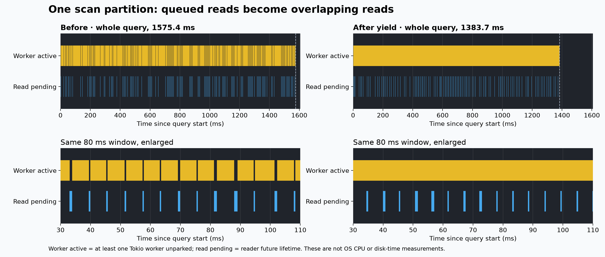
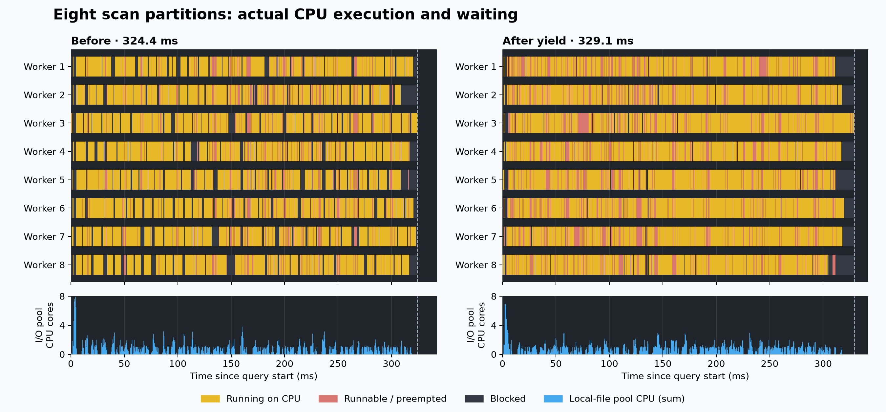

<!---
  Licensed to the Apache Software Foundation (ASF) under one
  or more contributor license agreements.  See the NOTICE file
  distributed with this work for additional information
  regarding copyright ownership.  The ASF licenses this file
  to you under the Apache License, Version 2.0 (the
  "License"); you may not use this file except in compliance
  with the License.  You may obtain a copy of the License at

    http://www.apache.org/licenses/LICENSE-2.0

  Unless required by applicable law or agreed to in writing,
  software distributed under the License is distributed on an
  "AS IS" BASIS, WITHOUT WARRANTIES OR CONDITIONS OF ANY
  KIND, either express or implied.  See the License for the
  specific language governing permissions and limitations
  under the License.
-->

# Whole-query CPU and I/O overlap

The September 12 profile found a scheduling gap in the existing prefetch patch:
a spawned read could stay queued while the query task continued synchronous
decoding on the same Tokio worker. Yielding once after successfully scheduling
the next row group removes most of that wait. This is a five-line production
change; prefetch depth and memory limits stay the same.

## What was measured

The baseline is [PR head `a8f744db6`](https://github.com/peterxcli/datafusion/commit/a8f744db6bf6f147e2ea88fcf03e0f0b977f4683),
which contains reader implementation `801cb0e52`. The after binary adds the yield
in `PushDecoderStreamState::next`. Both use DataFusion 55, Parquet 59.3.0,
Tokio 1.53.1, Rust 1.95.0, the same lockfile, and `release-nonlto` on an Apple M4
with 10 cores and 24 GiB RAM. This isolates the change to the current patch;
the [earlier report](IO_POLICY_BENCHMARK.md), built with Rust 1.97.0, compares the original patch against
upstream `408696966`.

The [runner](../../benchmarks/examples/io_overlap.rs) executes a complete SQL
filtered aggregate in a spawned Tokio task, with eight runtime workers and
either one or eight scan partitions. The earlier reader harness consumed its
stream from the runtime's top-level `block_on`, which does not exercise the
same worker-local scheduling path.

```sql
SELECT COUNT(*) AS rows, SUM(c0 + c2 + c3 + c4 + c5 + c6 + c7) AS checksum
FROM input
WHERE c1 < 10000;
```

The narrow query uses `SUM(c0)`. Both reuse the existing 256-row-group fixtures:
33,554,432 rows, eight Int64 columns, Snappy, and 2 GiB of logical values per
file. Random matching rows have no page index; clustered matching rows have
page indexes. These two workloads vary both distribution and index availability,
so they are not a controlled comparison of either variable alone.

All 384 before/after query executions checked row counts and checksums against
values independently calculated by the fixture generator. Every paired run also
requested identical bytes, prefetched the same row groups, and had identical
budget-skip counts. The prefetch budget was 16 MiB per stream.

Timing runs had no tracing, artificial latency, or concurrent builds. Each
process ran one warmup and three measured iterations. Pass 1 ran before/after
pairs; pass 2 reversed both pair order and case order. These are warm local-file
measurements on an active desktop. The two passes expose variation rather than
provide confidence intervals.

## Does the read overlap CPU work?



With one partition, the runtime event trace changed as follows (medians of three
measured wide queries with row filtering after decoding and prefetch enabled):

| Metric                                                           |   Before |   After |
| ---------------------------------------------------------------- | -------: | ------: |
| Read-pending time overlapping at least one active runtime worker |     2.2% |   99.7% |
| Wall time with all query workers parked                          | 156.6 ms | 0.69 ms |
| Wall time with all query workers parked while a read was pending | 156.5 ms | 0.52 ms |

Here, active means not parked by Tokio; it can include time when the OS
preempts that thread. A reader interval is the lifetime of its asynchronous
read future, including submission, local-file work, scheduling, and wakeup.
It is not a measurement of physical disk latency. Tracing runs install a reader
wrapper and are separate from the uninstrumented timing comparison.

One scan partition only supplies roughly one worker's worth of CPU work.
Seven otherwise idle runtime workers are therefore expected. The useful change
is removing periods when the query has no worker doing work while awaiting I/O,
not making all eight workers busy on a serial scan.

The native System Trace profile independently records actual OS thread states
for eight-partition queries. Worker identities come from thread names, or the
Tokio worker entry point in sampled call stacks when Instruments omits names.
The parser checks that all eight workers are identified and their states cover
the entire query window. Each figure shows the measured query nearest its
recording's median duration, with identical horizontal scales.



| Native metric, median of 15 measured queries |     Before |      After |
| -------------------------------------------- | ---------: | ---------: |
| Summed worker blocked time                   |   409.6 ms |   174.8 ms |
| Summed worker running time                   | 1,906.2 ms | 1,953.5 ms |
| Summed worker preempted time                 |   237.5 ms |   483.8 ms |
| Summed worker runnable time                  |    38.7 ms |    22.4 ms |
| Profiled query wall time                     |   324.4 ms |   329.1 ms |

Blocked time fell 57%, but this native recording does **not** show a wall-time
improvement: OS preemption rose in the second recording. The red portions are
runnable/preempted work, not idle CPU. The separate, uninstrumented comparisons
below establish the latency effect. Summed thread times can exceed query wall
time because eight workers run concurrently; medians of individual states do
not have to sum to the median total.

The [plot input](benchmark-charts/io-overlap-timeline.json) contains only this
benchmark's representative thread intervals and per-query summaries. Plot
coordinates are rounded to microseconds; summaries retain full precision.
[`plot_io_overlap.py`](benchmark-charts/plot_io_overlap.py) regenerates both
figures using matplotlib. Native recordings and runtime traces are separate
from the uninstrumented timing measurements.

## Query latency

For random rows without page indexes, the single-partition queries used
7–11% less elapsed time across both widths and all three reading modes.
Eight-partition wide queries with pushdown used 5–9% less time in both passes.
The eight-partition queries already overlap I/O across partitions, so this
change has less idle time available to remove.

Small indexed queries remain mixed. For example, the eight-partition narrow
progressive query used 1.5%/2.7% more time (about 0.06/0.10 ms), while the indexed
wide upfront query changed from 25.6% faster to 14.0% slower across passes.
The random wide query without pushdown also drifted substantially in pass 2.
These results do not justify a universal speedup claim or a new default.

Modes: `off` filters after decoding; `progressive` pushes filters down and reads
filter columns before output columns; `upfront` pushes filters down and reads
both sets of selected pages together. Prefetch is enabled in every row below.
Values are median milliseconds; a negative change means less query time.

| Distribution / index | Output columns | Partitions | Mode        | Before 1 | After 1 | Change 1 | Before 2 | After 2 | Change 2 |
| -------------------- | -------------: | ---------: | ----------- | -------: | ------: | -------: | -------: | ------: | -------: |
| random               |              7 |          1 | off         |  1503.04 | 1389.32 |    -7.6% |  1527.62 | 1385.18 |    -9.3% |
| random               |              7 |          1 | progressive |  1540.56 | 1421.13 |    -7.8% |  1543.21 | 1415.57 |    -8.3% |
| random               |              7 |          1 | upfront     |  1574.20 | 1408.12 |   -10.5% |  1542.94 | 1404.79 |    -9.0% |
| random               |              7 |          8 | off         |   301.52 |  293.11 |    -2.8% |   378.27 |  312.95 |   -17.3% |
| random               |              7 |          8 | progressive |   288.37 |  270.91 |    -6.1% |   295.61 |  270.31 |    -8.6% |
| random               |              7 |          8 | upfront     |   300.03 |  284.30 |    -5.2% |   294.91 |  275.65 |    -6.5% |
| random               |              1 |          1 | off         |   350.97 |  322.95 |    -8.0% |   352.61 |  323.98 |    -8.1% |
| random               |              1 |          1 | progressive |   349.38 |  319.09 |    -8.7% |   349.64 |  323.98 |    -7.3% |
| random               |              1 |          1 | upfront     |   361.43 |  323.54 |   -10.5% |   352.47 |  318.99 |    -9.5% |
| random               |              1 |          8 | off         |    75.25 |   66.84 |   -11.2% |    70.31 |   67.30 |    -4.3% |
| random               |              1 |          8 | progressive |    69.24 |   66.04 |    -4.6% |    67.44 |   68.87 |    +2.1% |
| random               |              1 |          8 | upfront     |    70.33 |   66.41 |    -5.6% |    70.42 |   70.34 |    -0.1% |
| clustered            |              7 |          1 | off         |    36.60 |   29.83 |   -18.5% |    36.77 |   29.83 |   -18.9% |
| clustered            |              7 |          1 | progressive |    35.13 |   27.91 |   -20.6% |    35.35 |   28.31 |   -19.9% |
| clustered            |              7 |          1 | upfront     |    34.80 |   28.08 |   -19.3% |    34.60 |   31.84 |    -8.0% |
| clustered            |              7 |          8 | off         |     9.64 |    9.25 |    -4.1% |     9.08 |    9.33 |    +2.8% |
| clustered            |              7 |          8 | progressive |     8.18 |    7.43 |    -9.1% |     8.30 |    7.46 |   -10.1% |
| clustered            |              7 |          8 | upfront     |    10.03 |    7.46 |   -25.6% |     8.64 |    9.86 |   +14.0% |
| clustered            |              1 |          1 | off         |    14.11 |   10.02 |   -29.0% |    13.03 |    9.78 |   -24.9% |
| clustered            |              1 |          1 | progressive |    14.08 |   12.68 |    -9.9% |    15.60 |   12.59 |   -19.3% |
| clustered            |              1 |          1 | upfront     |    14.42 |   12.56 |   -12.9% |    13.73 |   12.38 |    -9.9% |
| clustered            |              1 |          8 | off         |     3.94 |    3.79 |    -3.7% |     4.02 |    3.85 |    -4.3% |
| clustered            |              1 |          8 | progressive |     3.70 |    3.76 |    +1.5% |     3.73 |    3.83 |    +2.7% |
| clustered            |              1 |          8 | upfront     |     3.92 |    3.64 |    -7.0% |     3.94 |    3.73 |    -5.3% |

[All query measurements, including warmups](benchmark-charts/io-overlap-queries.csv)
are available as CSV. Iteration zero is excluded from the medians.
`prefetch_wait_time` is summed across partitions and measured in nanoseconds.

## Why the yield is needed

On this Tokio version, spawning from a worker puts the new task into its local
LIFO slot. Another worker cannot steal that slot. The scan can keep decoding
and its consumer can keep processing ready batches without returning to the
scheduler, so the queued read starts only when the consumer finally awaits it.

The decoder now yields immediately after a prefetch task is successfully
created, giving that task a chance to issue its read before CPU work continues.
It does not yield when prefetch is disabled, the budget cannot be reserved, or
there is no next row group.

`prefetch_starts_while_consumer_uses_worker` reproduces the issue inside a spawned
query task: after receiving a batch, the consumer does CPU work without an
await, while another worker can start the next read. It fails against the
baseline (one read started instead of two) and passes with the yield. The
existing decoder tests cover cancellation, budget pressure, speculative errors,
pruning, and ordering.

## Reproduce

Generate or reuse fixtures and independent expected values with the existing
`datafusion-datasource-parquet` `io_policy` example (arguments `256 /tmp/io-data`).
Build the query runner on the baseline and on this patch, keeping separate
copies of the executable. The timed binaries used Rust 1.95.0; repository
validation uses its pinned Rust 1.97.0:

```bash
cargo +1.95.0 build --locked --profile release-nonlto \
  -p datafusion-benchmarks --example io_overlap

target/release-nonlto/examples/io_overlap \
  --path /tmp/io-data/scan-false-false-256.parquet \
  --mode off --partitions 1 --prefetch-bytes 16777216 --iterations 4 \
  --expected-rows 336704 --expected-checksum 6662726950778
```

Use `--partitions 8`, `--mode progressive`, `--mode upfront`, and `--narrow` for
the other cases, with the appropriate generator checksum for each projection.
`--prefetch-bytes 0` supplies the disabled control. `--trace events.json` records
runtime park/unpark events and read-future intervals. On macOS, Instruments
System Trace records actual thread running/blocked states; `--start-delay-ms 3000` allows tracing to start before the runtime creates its threads. Keep native
profiles separate from timing runs and exclude the first iteration.

## Remaining scope

The within-row-group I/O policy requested by
[DataFusion #24393](https://github.com/apache/datafusion/issues/24393) is separate
from next-row-group prefetch. `progressive_io=false` provides the former; this
follow-up repairs scheduling of the latter. The issue's proposed defaults still
need an upstream decision. Physical object-store request counts, remote latency,
and the Spark/Comet execution path remain unmeasured by this profile. The Comet
POC is still pinned to its earlier DataFusion implementation.

## Validation

The new scheduler regression failed on the baseline and passed after the change.
All 259 Parquet library tests passed (one manual benchmark ignored), including
cancellation, ordering, pruning, budget exhaustion, and speculative I/O failure.
The timing comparison independently validated all 384 query results and equal
requested-byte/prefetch counters between revisions.

The SQL page-pruning regression, workspace Clippy, formatting, and the standard
`dev/rust_lint.sh` suite also passed using the pinned Rust 1.97.0.
