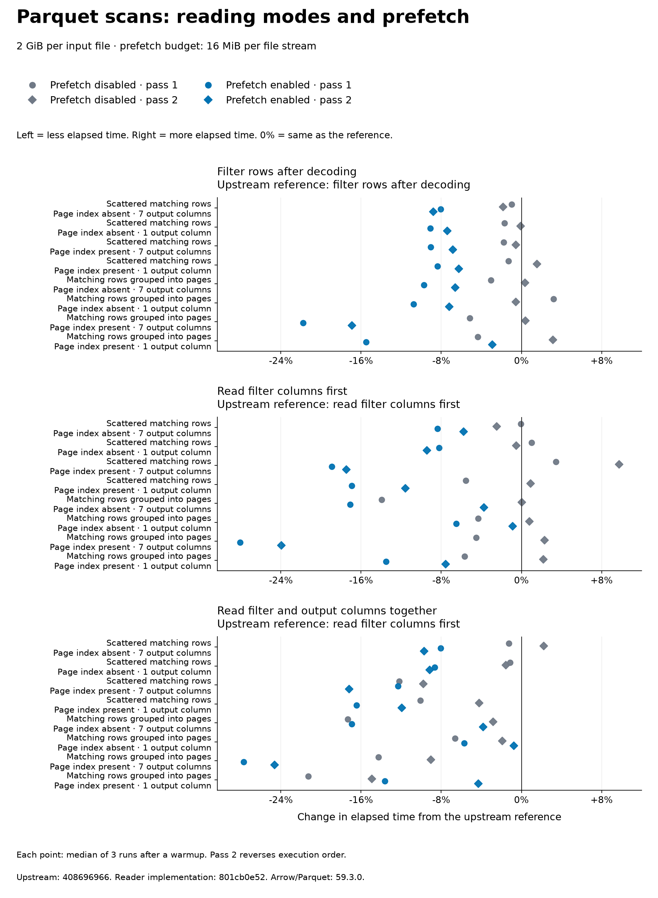
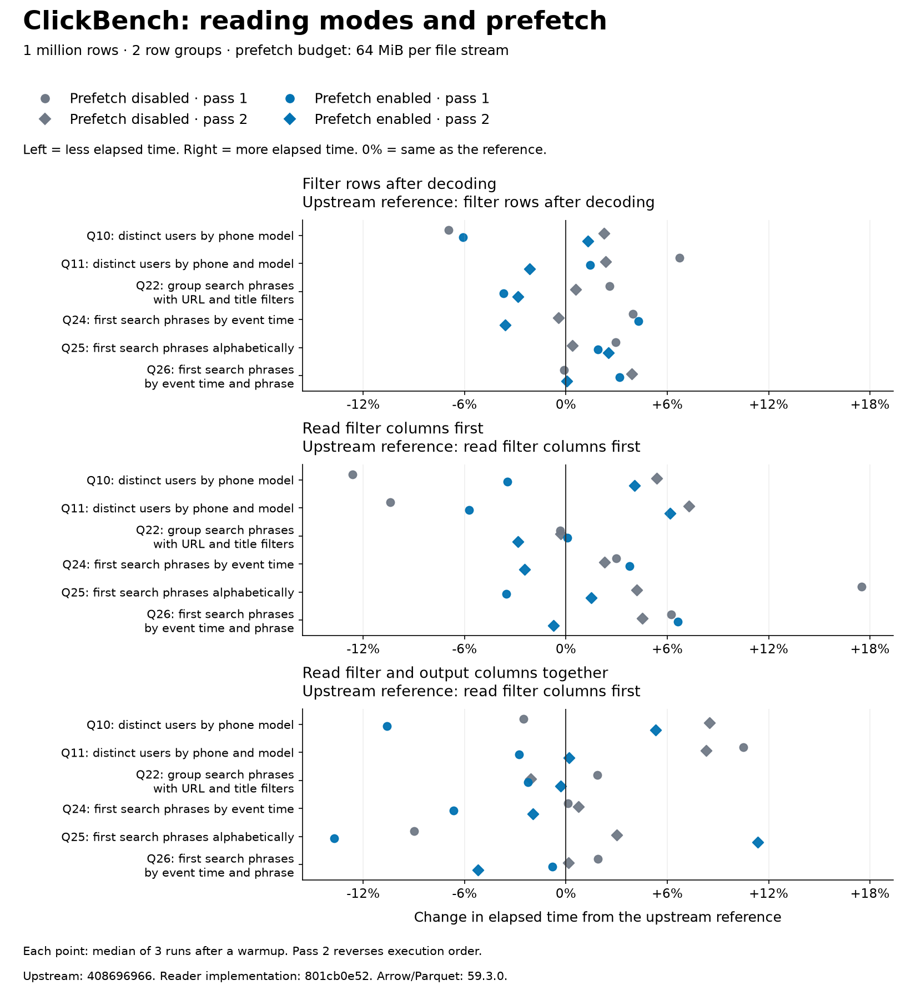

<!---
  Licensed to the Apache Software Foundation (ASF) under one
  or more contributor license agreements.  See the NOTICE file
  distributed with this work for additional information
  regarding copyright ownership.  The ASF licenses this file
  to you under the Apache License, Version 2.0 (the
  "License"); you may not use this file except in compliance
  with the License.  You may obtain a copy of the License at

    http://www.apache.org/licenses/LICENSE-2.0

  Unless required by applicable law or agreed to in writing,
  software distributed under the License is distributed on an
  "AS IS" BASIS, WITHOUT WARRANTIES OR CONDITIONS OF ANY
  KIND, either express or implied.  See the License for the
  specific language governing permissions and limitations
  under the License.
-->

# Parquet I/O benchmarks: current patch versus upstream main

These measurements compare the current patch with upstream `main` fetched on
2026-09-10. Both use Rust 1.97.0 and the `release-nonlto` profile on an Apple M4
with 10 CPU cores and 24 GiB RAM.

| Revision                                                                                                          | DataFusion | Arrow/Parquet |
| ----------------------------------------------------------------------------------------------------------------- | ---------- | ------------- |
| [Upstream main `408696966`](https://github.com/apache/datafusion/commit/4086969669f96c0d5de03f442f2dba1869d2ee80) | 55.0.0     | 59.3.0        |
| [Current reader implementation `801cb0e52`](https://github.com/peterxcli/datafusion/commit/801cb0e52)             | 55.0.0     | 59.3.0        |

The patch is rebased onto the measured upstream commit. Both revisions use
the same dependency lockfile, with Arrow/Parquet 59.3.0.

## Reading modes shown in the charts

| Chart label                             | What happens                                                                                  | `pushdown_filters` | `progressive_io` |
| --------------------------------------- | --------------------------------------------------------------------------------------------- | ------------------ | ---------------- |
| Filter rows after decoding              | Decode the scan output, then apply the row filter.                                            | `false`            | `true`           |
| Read filter columns first               | Read columns used by the filter, evaluate it, then read output pages needed by matching rows. | `true`             | `true`           |
| Read filter and output columns together | Fetch both sets of required pages for the current row group before evaluating the row filter. | `true`             | `false`          |

Prefetch means reading the next row group while decoding the current one. Each
chart shows all three reading modes with prefetch enabled and disabled. The
synthetic scans use a 16 MiB prefetch budget per file stream. ClickBench uses
64 MiB so that its larger projected row groups, including Q22's string columns,
fit within the budget.

Each panel names the upstream behavior used as its reference. Points show the
percentage change in elapsed time: −10% means 10% less time, and 0% means the
same time. The legend identifies both the prefetch setting and the measurement
pass. Pass 2 reverses execution order.

## Synthetic Parquet scans



Reading filter and output columns together reduced reader calls from **512 to
256** without page indexes and from **513 to 257** with page indexes. All
configurations requested the same bytes. With page indexes and matching rows
grouped into pages, scans read 28.9 MB for 7 output columns and 13.2 MB for
1 output column.

For that workload, reading columns together with prefetch disabled took
**41.3/41.0 ms** for 7 output columns across the two passes. Upstream reading
filter columns first took **48.2/45.1 ms**, so the patch used 9–14% less time.
Returning 1 column took **20.1/20.1 ms** versus **25.5/23.7 ms** (15–21% less).

Results varied by workload. With scattered matching rows, 7 output columns,
and no page index, the patch used 1.2% less time in pass 1 and 2.2% more in
pass 2. With matching rows grouped into pages, 7 output columns, and no page
index, upstream moved from 361.1 to 305.8 ms between passes; the patch reading
columns together measured 298.6 and 297.1 ms. These desktop measurements retain
variation that two reversed passes cannot eliminate.

The patch reading filter columns first was also 3.4%/9.7% slower than upstream
using the same mode when matching rows were scattered, page indexes were
present, and the output had 7 columns. This control warrants profiling.

The [benchmark example](examples/io_policy.rs) uses four Snappy Parquet files,
each containing 256 row groups of 131,072 rows and eight Int64 columns:
33,554,432 rows and 2 GiB of logical values per file. Both binaries read the same
files, generated by the patch runner. File generation and expected-result
calculation are outside the timed region.

The predicate is `c1 < 10000`. The output contains either 7 columns or 1 column,
always omitting the predicate column. Matching rows are either scattered or
grouped into pages. Each distribution is tested with and without column and
offset indexes. Every scan checks its row count and checksum against values
calculated during generation.
All 512 full-size scans passed, as did 256 smoke scans on one-row-group files.

Statistics and page-index pruning remain enabled in every configuration.
When row filtering follows decoding, `FilterExec` applies the same predicate
before projecting the output columns.

The runtime has two Tokio workers and an 8,192-row batch size. Each pass rotates
configuration order across one warmup and three measured rounds. Revision order
is patch/main for the first pass and main/patch for the second. No builds from
this task ran during measurement. These are warm local-file timings, with no
artificial I/O or downstream delay. Other desktop activity was uncontrolled.

<details>
<summary>Exact median elapsed times for the synthetic scans</summary>

### Filter rows after decoding

Upstream reference: filter rows after decoding. All times are milliseconds.

| Workload                                                                | Upstream pass 1 | Upstream pass 2 | Patch, prefetch disabled, pass 1 | Patch, prefetch disabled, pass 2 | Patch, prefetch enabled, pass 1 | Patch, prefetch enabled, pass 2 |
| ----------------------------------------------------------------------- | --------------: | --------------: | -------------------------------: | -------------------------------: | ------------------------------: | ------------------------------: |
| Scattered matching rows; Page index absent · 7 output columns           |         1521.53 |         1527.06 |                          1506.81 |                          1498.96 |                         1398.62 |                         1392.46 |
| Scattered matching rows; Page index absent · 1 output column            |          363.08 |          355.38 |                           357.00 |                           355.08 |                          330.12 |                          329.01 |
| Scattered matching rows; Page index present · 7 output columns          |         1539.80 |         1503.95 |                          1512.38 |                          1494.98 |                         1400.22 |                         1400.60 |
| Scattered matching rows; Page index present · 1 output column           |          366.42 |          359.62 |                           361.67 |                           365.06 |                          335.70 |                          337.12 |
| Matching rows grouped into pages; Page index absent · 7 output columns  |         1551.31 |         1497.14 |                          1504.23 |                          1502.20 |                         1400.58 |                         1398.02 |
| Matching rows grouped into pages; Page index absent · 1 output column   |          358.32 |          345.43 |                           369.85 |                           343.39 |                          319.80 |                          320.48 |
| Matching rows grouped into pages; Page index present · 7 output columns |           45.63 |           43.08 |                            43.29 |                            43.25 |                           35.70 |                           35.78 |
| Matching rows grouped into pages; Page index present · 1 output column  |           20.95 |           19.71 |                            20.04 |                            20.32 |                           17.70 |                           19.13 |

### Read filter columns first

Upstream reference: read filter columns first. All times are milliseconds.

| Workload                                                                | Upstream pass 1 | Upstream pass 2 | Patch, prefetch disabled, pass 1 | Patch, prefetch disabled, pass 2 | Patch, prefetch enabled, pass 1 | Patch, prefetch enabled, pass 2 |
| ----------------------------------------------------------------------- | --------------: | --------------: | -------------------------------: | -------------------------------: | ------------------------------: | ------------------------------: |
| Scattered matching rows; Page index absent · 7 output columns           |         1543.61 |         1559.83 |                          1542.49 |                          1520.79 |                         1414.53 |                         1469.71 |
| Scattered matching rows; Page index absent · 1 output column            |          356.33 |          357.13 |                           360.01 |                           355.26 |                          327.01 |                          323.43 |
| Scattered matching rows; Page index present · 7 output columns          |         1765.25 |         1726.66 |                          1825.76 |                          1894.46 |                         1431.53 |                         1424.55 |
| Scattered matching rows; Page index present · 1 output column           |          402.42 |          378.23 |                           380.15 |                           381.61 |                          334.23 |                          334.29 |
| Matching rows grouped into pages; Page index absent · 7 output columns  |          361.10 |          305.83 |                           310.71 |                           305.89 |                          299.42 |                          294.27 |
| Matching rows grouped into pages; Page index absent · 1 output column   |          218.94 |          208.05 |                           209.51 |                           209.67 |                          204.71 |                          206.19 |
| Matching rows grouped into pages; Page index present · 7 output columns |           48.21 |           45.14 |                            46.03 |                            46.18 |                           34.67 |                           34.31 |
| Matching rows grouped into pages; Page index present · 1 output column  |           25.51 |           23.69 |                            24.07 |                            24.20 |                           22.06 |                           21.89 |

### Read filter and output columns together

Upstream reference: read filter columns first. All times are milliseconds.

| Workload                                                                | Upstream pass 1 | Upstream pass 2 | Patch, prefetch disabled, pass 1 | Patch, prefetch disabled, pass 2 | Patch, prefetch enabled, pass 1 | Patch, prefetch enabled, pass 2 |
| ----------------------------------------------------------------------- | --------------: | --------------: | -------------------------------: | -------------------------------: | ------------------------------: | ------------------------------: |
| Scattered matching rows; Page index absent · 7 output columns           |         1543.61 |         1559.83 |                          1524.44 |                          1594.31 |                         1418.95 |                         1408.30 |
| Scattered matching rows; Page index absent · 1 output column            |          356.33 |          357.13 |                           352.35 |                           351.53 |                          325.45 |                          324.37 |
| Scattered matching rows; Page index present · 7 output columns          |         1765.25 |         1726.66 |                          1550.04 |                          1557.13 |                         1547.51 |                         1429.41 |
| Scattered matching rows; Page index present · 1 output column           |          402.42 |          378.23 |                           361.80 |                           362.27 |                          336.21 |                          333.01 |
| Matching rows grouped into pages; Page index absent · 7 output columns  |          361.10 |          305.83 |                           298.56 |                           297.11 |                          300.00 |                          294.13 |
| Matching rows grouped into pages; Page index absent · 1 output column   |          218.94 |          208.05 |                           204.40 |                           204.03 |                          206.42 |                          206.41 |
| Matching rows grouped into pages; Page index present · 7 output columns |           48.21 |           45.14 |                            41.34 |                            41.04 |                           34.84 |                           34.00 |
| Matching rows grouped into pages; Page index present · 1 output column  |           25.51 |           23.69 |                            20.09 |                            20.14 |                           22.03 |                           22.66 |

</details>

### Requested bytes, reader calls, and memory

`bytes_scanned` includes metadata and speculative reads. Reader calls count
invocations observed by the reader wrapper, excluding footer reads inside
`get_metadata`. They do not count physical disk operations or HTTP requests.
The following counts use prefetch disabled and were identical across the two passes.

<details>
<summary>Exact requested bytes and reader calls</summary>

| Workload                                                                | Upstream, filter columns first bytes | Patch, columns together bytes | Upstream, filter columns first calls | Patch, filter columns first calls | Patch, columns together calls |
| ----------------------------------------------------------------------- | -----------------------------------: | ----------------------------: | -----------------------------------: | --------------------------------: | ----------------------------: |
| Scattered matching rows; Page index absent · 7 output columns           |                        1,309,357,880 |                 1,309,357,880 |                                  512 |                               512 |                           256 |
| Scattered matching rows; Page index absent · 1 output column            |                          303,126,105 |                   303,126,105 |                                  512 |                               512 |                           256 |
| Scattered matching rows; Page index present · 7 output columns          |                        1,318,274,373 |                 1,318,274,373 |                                  513 |                               513 |                           257 |
| Scattered matching rows; Page index present · 1 output column           |                          312,042,598 |                   312,042,598 |                                  513 |                               513 |                           257 |
| Matching rows grouped into pages; Page index absent · 7 output columns  |                        1,278,042,437 |                 1,278,042,437 |                                  512 |                               512 |                           256 |
| Matching rows grouped into pages; Page index absent · 1 output column   |                          271,810,662 |                   271,810,662 |                                  512 |                               512 |                           256 |
| Matching rows grouped into pages; Page index present · 7 output columns |                           28,883,141 |                    28,883,141 |                                  513 |                               513 |                           257 |
| Matching rows grouped into pages; Page index present · 1 output column  |                           13,160,491 |                    13,160,491 |                                  513 |                               513 |                           257 |

</details>

Prefetch memory is measured with `PeakRecordingPool`. Upstream has no prefetch
reservation. The patch's figures cover additional compressed reservations;
current-reader, decoded-buffer, and total process memory are outside this metric.

For 7 output columns, peak prefetch reservations ranged from 78,078 to 5,115,597 bytes.

For 1 output column, peak prefetch reservations ranged from 16,587 to 1,184,818 bytes.

## ClickBench

The runner now accepts `--prefetch-bytes`, so this comparison includes both
prefetch settings for all three reading modes. All 384 executions returned ten
rows. Every execution with prefetch enabled completed one row-group prefetch,
verified through the reader's `prefetch_row_groups` metric.

Prefetch had a mixed effect on this input. With row filtering after decoding,
Q22 took **77.21/76.88 ms with prefetch** versus **82.25/79.58 ms without**
across the two passes (3–6% less time). Reading filter and output columns
together, Q11 took **4.87/5.00 ms with prefetch** versus **5.54/5.41 ms without**
(7–12% less).

Other cases changed direction. Reading columns together, Q25 took
6.17 versus 6.51 ms with/without prefetch in pass 1, but 6.89 versus 6.38 ms
in pass 2. Both modes that filter during decoding remained slower than
upstream filtering after decoding for every query, even with prefetch enabled.



The existing `dfbench clickbench` runner executes unchanged Q10, Q11, Q22, Q24,
Q25, and Q26 SQL files against the same public
[`hits_0.parquet`](https://datasets.clickhouse.com/hits_compatible/athena_partitioned/hits_0.parquet)
file: 122,446,530 bytes, 1,000,000 rows, and two row groups. This is one partition
of the 100-file dataset. Both revisions use one target partition and enable
filter reordering. Prefetch uses a 64 MiB budget per file stream and the query's
memory pool. The file provides only one next-row-group prefetch per scan.

Each case has one warmup and three measured iterations. The second pass reverses
the order of all eight revision/configuration combinations. Each chart panel
names its upstream reference. Query result values were not independently
compared; validation checks row counts and successful prefetch activity.

<details>
<summary>Exact median ClickBench times</summary>

### Filter rows after decoding

Upstream reference: filter rows after decoding. All times are milliseconds.

| Workload                                             | Upstream pass 1 | Upstream pass 2 | Patch, prefetch disabled, pass 1 | Patch, prefetch disabled, pass 2 | Patch, prefetch enabled, pass 1 | Patch, prefetch enabled, pass 2 |
| ---------------------------------------------------- | --------------: | --------------: | -------------------------------: | -------------------------------: | ------------------------------: | ------------------------------: |
| Q10: distinct users by phone model                   |            3.98 |            3.77 |                             3.70 |                             3.85 |                            3.74 |                            3.81 |
| Q11: distinct users by phone and model               |            4.07 |            4.20 |                             4.35 |                             4.30 |                            4.13 |                            4.11 |
| Q22: group search phrases with URL and title filters |           80.18 |           79.12 |                            82.25 |                            79.58 |                           77.21 |                           76.88 |
| Q24: first search phrases by event time              |            6.39 |            6.82 |                             6.64 |                             6.79 |                            6.66 |                            6.58 |
| Q25: first search phrases alphabetically             |            4.32 |            4.39 |                             4.45 |                             4.41 |                            4.41 |                            4.50 |
| Q26: first search phrases by event time and phrase   |            6.86 |            6.72 |                             6.85 |                             6.98 |                            7.07 |                            6.72 |

### Read filter columns first

Upstream reference: read filter columns first. All times are milliseconds.

| Workload                                             | Upstream pass 1 | Upstream pass 2 | Patch, prefetch disabled, pass 1 | Patch, prefetch disabled, pass 2 | Patch, prefetch enabled, pass 1 | Patch, prefetch enabled, pass 2 |
| ---------------------------------------------------- | --------------: | --------------: | -------------------------------: | -------------------------------: | ------------------------------: | ------------------------------: |
| Q10: distinct users by phone model                   |            4.85 |            4.25 |                             4.24 |                             4.48 |                            4.69 |                            4.42 |
| Q11: distinct users by phone and model               |            5.01 |            4.99 |                             4.49 |                             5.36 |                            4.72 |                            5.30 |
| Q22: group search phrases with URL and title filters |           94.45 |           96.76 |                            94.14 |                            96.46 |                           94.53 |                           94.01 |
| Q24: first search phrases by event time              |            8.24 |            8.45 |                             8.48 |                             8.64 |                            8.55 |                            8.24 |
| Q25: first search phrases alphabetically             |            7.15 |            6.19 |                             8.40 |                             6.45 |                            6.90 |                            6.28 |
| Q26: first search phrases by event time and phrase   |            8.83 |            9.48 |                             9.38 |                             9.90 |                            9.42 |                            9.41 |

### Read filter and output columns together

Upstream reference: read filter columns first. All times are milliseconds.

| Workload                                             | Upstream pass 1 | Upstream pass 2 | Patch, prefetch disabled, pass 1 | Patch, prefetch disabled, pass 2 | Patch, prefetch enabled, pass 1 | Patch, prefetch enabled, pass 2 |
| ---------------------------------------------------- | --------------: | --------------: | -------------------------------: | -------------------------------: | ------------------------------: | ------------------------------: |
| Q10: distinct users by phone model                   |            4.85 |            4.25 |                             4.73 |                             4.61 |                            4.34 |                            4.48 |
| Q11: distinct users by phone and model               |            5.01 |            4.99 |                             5.54 |                             5.41 |                            4.87 |                            5.00 |
| Q22: group search phrases with URL and title filters |           94.45 |           96.76 |                            96.22 |                            94.75 |                           92.33 |                           96.46 |
| Q24: first search phrases by event time              |            8.24 |            8.45 |                             8.25 |                             8.51 |                            7.69 |                            8.29 |
| Q25: first search phrases alphabetically             |            7.15 |            6.19 |                             6.51 |                             6.37 |                            6.17 |                            6.89 |
| Q26: first search phrases by event time and phrase   |            8.83 |            9.48 |                             9.00 |                             9.49 |                            8.76 |                            8.98 |

</details>

These local samples do not establish full-dataset, remote-storage, or Spark
end-to-end performance. Broader measurements are needed before changing defaults.

## Reproduce

Build both runners using the same Rust toolchain and profile:

```sh
cargo build --locked --profile release-nonlto \
  -p datafusion-datasource-parquet --example io_policy \
  -p datafusion-benchmarks --bin dfbench
```

For main, copy the benchmark example from the patch, remove the
`with_row_group_prefetch` and `with_progressive_io` builder calls, and restrict
the configuration loop to filtering after decoding and reading filter columns
first, both without prefetch. Enable Tokio's
`rt-multi-thread` feature in the Parquet crate's dev dependencies.

Run the patch first to generate the shared input directory, then use that same
absolute directory for both binaries. Repeat in the opposite revision order.

```sh
target/release-nonlto/examples/io_policy 256 /tmp/io-policy-data > io-policy.csv
```

For ClickBench, use the same query directory and input file in both checkouts:

```sh
target/release-nonlto/dfbench clickbench --path hits_0.parquet \
  --queries-path benchmarks/queries/clickbench/queries --query 10 \
  --iterations 4 --partitions 1 --pushdown \
  -c datafusion.execution.parquet.reorder_filters=true
```

On the patch, add `-c datafusion.execution.parquet.progressive_io=false` to
read filter and output columns together. Add `--prefetch-bytes 67108864` to
enable prefetch, or `--prefetch-bytes 0` to disable it. The runner prints the
number of successfully prefetched row groups after each timed execution.

To filter after decoding, omit `--pushdown` and add
`-c datafusion.execution.parquet.pushdown_filters=false`. Run each of the three
patch reading modes with both prefetch budgets. Upstream runs filtering after
decoding and reading filter columns first. Repeat for query numbers 10, 11, 22,
24, 25, and 26, then reverse the configuration order.
