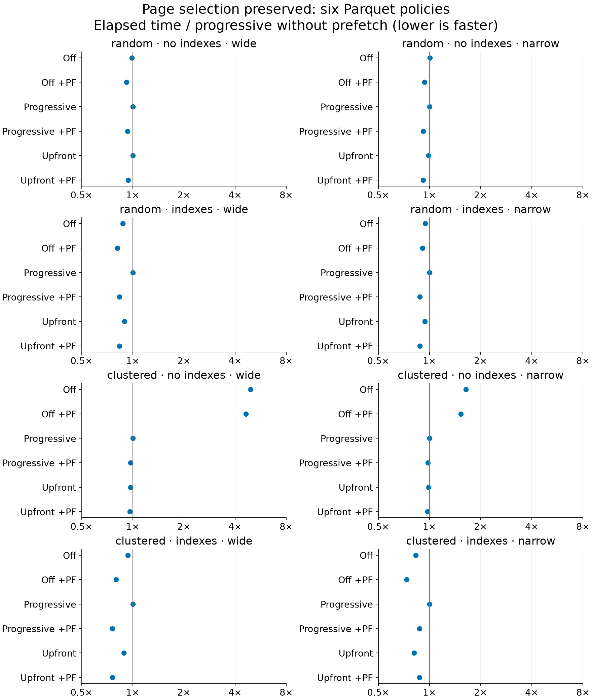
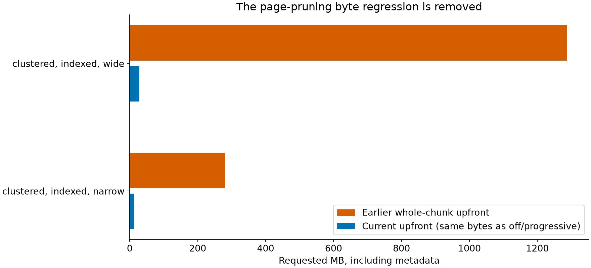
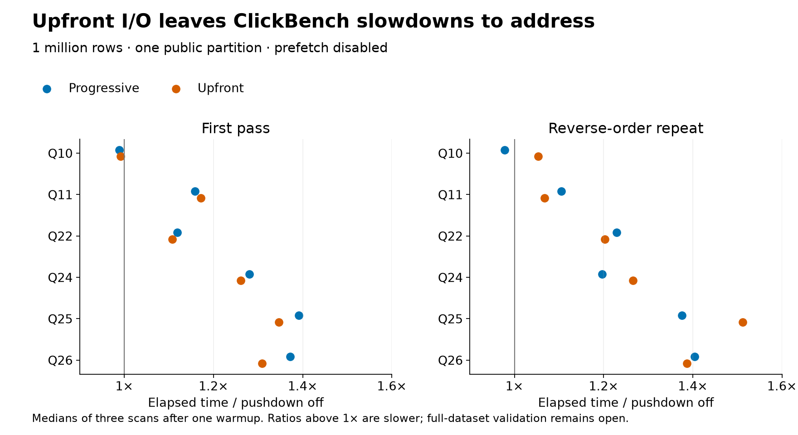
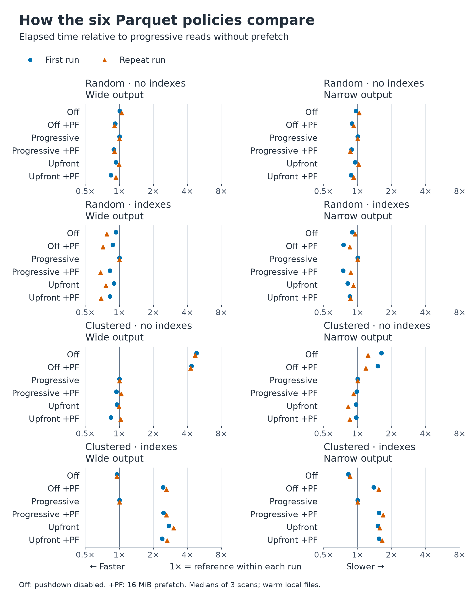
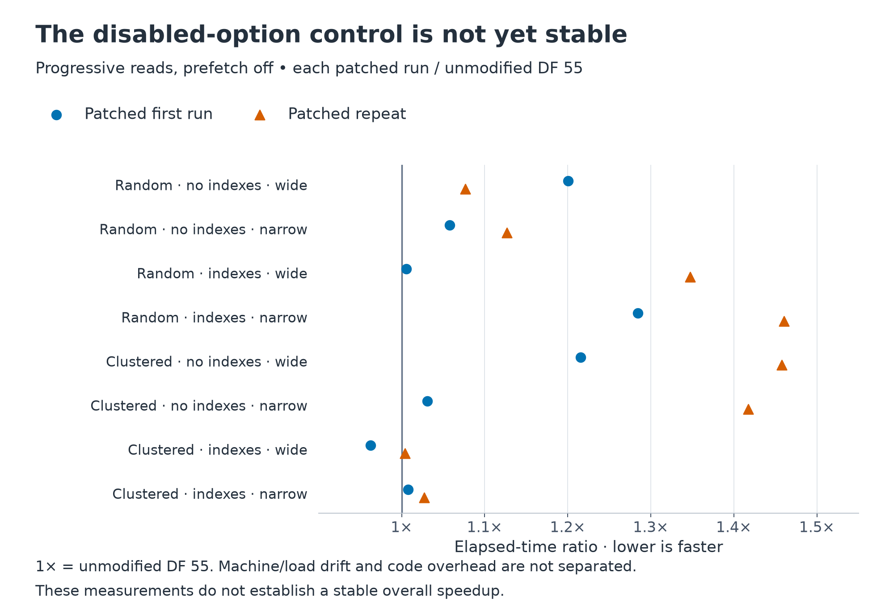
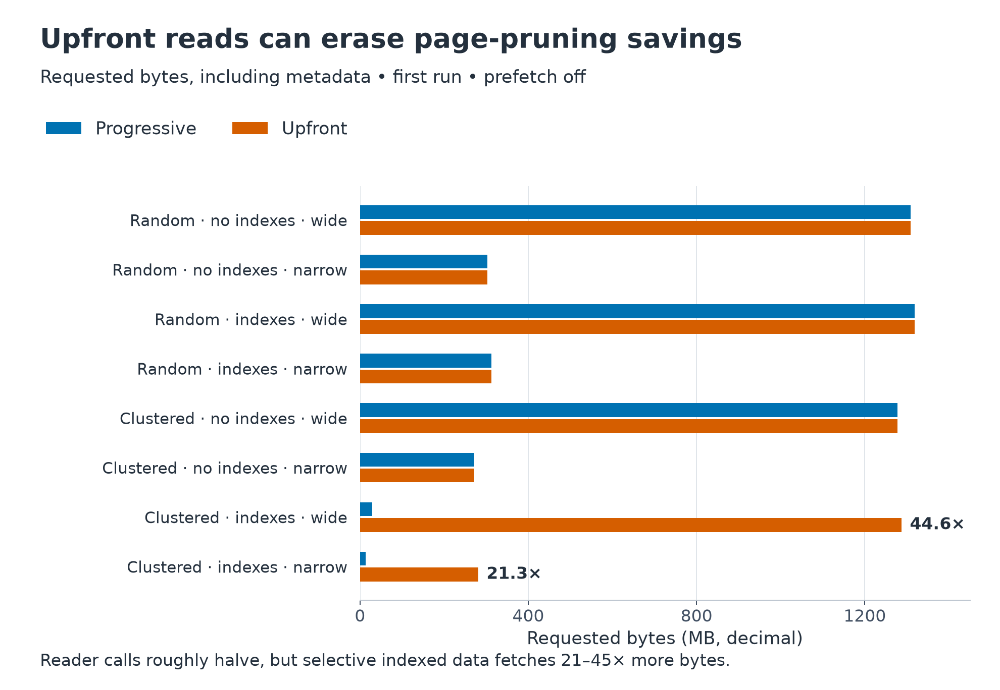

<!---
  Licensed to the Apache Software Foundation (ASF) under one
  or more contributor license agreements.  See the NOTICE file
  distributed with this work for additional information
  regarding copyright ownership.  The ASF licenses this file
  to you under the Apache License, Version 2.0 (the
  "License"); you may not use this file except in compliance
  with the License.  You may obtain a copy of the License at

    http://www.apache.org/licenses/LICENSE-2.0

  Unless required by applicable law or agreed to in writing,
  software distributed under the License is distributed on an
  "AS IS" BASIS, WITHOUT WARRANTIES OR CONDITIONS OF ANY
  KIND, either express or implied.  See the License for the
  specific language governing permissions and limitations
  under the License.
-->

# Parquet I/O policy experiment

This fork experiment targets DataFusion 55.0.0 so Comet can use the patch through
Cargo git dependencies. Progressive fetching remains the default and next-row-group
prefetch is disabled by default.

For `SELECT name FROM people WHERE age > 30`, **progressive reads** fetch the `age`
pages, evaluate the filter, then fetch the `name` pages needed for surviving rows.
**Upfront reads** fetch the required `age` and `name` pages together before
running the row filter. Both first use metadata to skip irrelevant row groups
and pages. Upfront reads reduce dependent I/O rounds, but can fetch pages that
the row filter would have ruled out.

The current implementation preserves the page selection made at file open,
including external row selections and dictionary pages. Adjacent ranges are merged
so a later whole-chunk decoder request can reuse them; gaps left by page pruning
remain unread. Without an offset index,
it fetches complete column chunks. Predicate caching can expand decoder requests
to batch boundaries; those requests remain supported, so this is not a promise
that every scan finishes in exactly one read per row group.

Use normal DataFusion session configuration, including SQL `SET`, before
registering the table:

```sql
SET datafusion.execution.parquet.pushdown_filters = true;
SET datafusion.execution.parquet.progressive_io = false;
```

`ParquetSource::with_progressive_io(false)` sets the same table option. The setting
survives plan serialization; older serialized plans retain progressive reads.
It does not enable filter pushdown automatically.

`with_row_group_prefetch(bytes, memory_pool)` separately fetches at most one next
row group's selected output and predicate pages while the current reader produces
batches. Its budget bounds additional compressed bytes, not current-reader or
decoded memory. A group is skipped if its selected bytes cannot fit. Dropping the
scan cancels pending work; speculative read errors retry through demand reads.
This execution-local prefetch option is not serialized.

Prefetch can fetch pages that later row filtering or dynamic pruning would skip.
Compare progressive and upfront with prefetch **off** to isolate the policy in
[#24393](https://github.com/apache/datafusion/issues/24393). Compare upfront with
prefetch off/on separately to assess overlap. Neither option changes defaults
or establishes that the broader filter-pushdown regressions are resolved.

## Reproduce

```sh
cargo run --profile release-nonlto -p datafusion-datasource-parquet \
  --example io_policy -- 256 > io-policy.csv
```

The example creates four local Snappy Parquet files in a temporary directory,
using 256 row groups of 131,072 rows and eight Int64 columns per file. That is
33,554,432 rows and 2 GiB of logical values per file. Files are generated and
measured one at a time; generation is outside the timed region.

The six configurations are pushdown off, pushdown with progressive fetching, and
pushdown with upfront fetching, each with prefetch off/on. The prefetch budget is
16 MiB. Every configuration evaluates the same predicate (`c1 < 10000`) and returns
the same columns. Pushdown-off plans retain a physical `FilterExec` before the
output projection. All configurations retain statistics and page-index pruning.

Each configuration runs against both scattered and page-clustered matches, with
and without column/offset indexes, and with either one or seven output columns.
The filter column is omitted from the output in every case. Writer metadata
assertions verify index presence/absence. Expected row counts and checksums are
calculated during generation and checked on every scan.

Round zero warms every configuration. The report uses medians of rounds 1–3,
rotating the order of all six configurations each round. The measured region
includes plan execution, decoding, filtering, and summing every output value.
There is no artificial I/O or downstream delay. These are warm local-file results;
they do not establish Spark end-to-end or remote-storage speedups.

`bytes_scanned` counts requested bytes, including metadata and speculative reads.
`reader_calls` and `reader_ranges` count calls/ranges observed by the reader wrapper,
excluding reads internal to `get_metadata`; they are not physical disk operations
or HTTP request counts. `prefetch_peak` uses DataFusion's existing `PeakRecordingPool` to record peak prefetch reservations. It does not measure current-reader, decoded-buffer, or total process memory. `prefetch_bytes` and `prefetch_row_groups` count completed
speculative reads, including bytes subsequently discarded.

## Page-selection revision (2026-09-10)

Apple M4, 10 CPU cores, 24 GiB RAM; Rust 1.97.0, Arrow/Parquet 59.2.0,
`release-nonlto`, two Tokio workers for the synthetic matrix.

The same 256-group matrix was rerun after preserving page selections. All 192 scans passed the independent row-count/checksum assertions. In all eight workloads and all six policies, requested byte counts now match the pushdown-off control, including prefetch. This equality is specific to this predicate-only fixture; row-filter selectivity, dictionary layout, and predicate-cache expansion can change the comparison in other queries.





<details>
<summary>Current medians in milliseconds</summary>

| Workload                      |    Off | Off +PF | Progressive | Progressive +PF | Upfront | Upfront +PF |
| ----------------------------- | -----: | ------: | ----------: | --------------: | ------: | ----------: |
| random, no indexes, wide      | 1494.4 |  1385.7 |      1512.0 |          1407.6 |  1516.2 |      1422.4 |
| random, no indexes, narrow    |  355.7 |   330.7 |       354.3 |           325.6 |   349.9 |       325.2 |
| random, indexes, wide         | 1500.1 |  1390.5 |      1715.8 |          1430.7 |  1534.6 |      1429.2 |
| random, indexes, narrow       |  356.8 |   344.4 |       378.9 |           332.8 |   355.3 |       332.4 |
| clustered, no indexes, wide   | 1479.3 |  1383.7 |       299.4 |           289.8 |   290.0 |       288.2 |
| clustered, no indexes, narrow |  340.2 |   318.5 |       208.1 |           203.2 |   205.7 |       202.7 |
| clustered, indexes, wide      |   44.4 |    37.8 |        47.5 |            36.0 |    42.1 |        36.0 |
| clustered, indexes, narrow    |   21.3 |    18.9 |        25.7 |            22.5 |    20.9 |        22.5 |

</details>

<details>
<summary>Current requested bytes and reader calls (prefetch off)</summary>

| Workload                      | Bytes (all policies) | Off calls | Progressive calls | Upfront calls |
| ----------------------------- | -------------------: | --------: | ----------------: | ------------: |
| random, no indexes, wide      |        1,309,357,880 |       256 |               512 |           256 |
| random, no indexes, narrow    |          303,126,105 |       256 |               512 |           256 |
| random, indexes, wide         |        1,318,274,373 |       257 |               513 |           257 |
| random, indexes, narrow       |          312,042,598 |       257 |               513 |           257 |
| clustered, no indexes, wide   |        1,278,042,437 |       256 |               512 |           256 |
| clustered, no indexes, narrow |          271,810,662 |       256 |               512 |           256 |
| clustered, indexes, wide      |           28,883,141 |       257 |               513 |           257 |
| clustered, indexes, narrow    |           13,160,491 |       257 |               513 |           257 |

</details>

All 255 future groups fit the 16 MiB prefetch budget. Peak compressed prefetch
reservations were 4.99–5.12 MB for wide output and 1.06–1.18 MB for narrow output
without effective page pruning. With indexed, clustered matches, the peaks fell
to 78,078 bytes (wide) and 16,587 bytes (narrow). These are exact reservation
peaks from `PeakRecordingPool`; current-reader, decoded-buffer, and process
memory are outside this measurement.

<details>
<summary>Fresh unmodified DF55 control, prefetch off (milliseconds)</summary>

| Workload                      | Baseline off | Current off | Baseline progressive | Current progressive |
| ----------------------------- | -----------: | ----------: | -------------------: | ------------------: |
| random, no indexes, wide      |       1493.3 |      1494.4 |               1503.0 |              1512.0 |
| random, no indexes, narrow    |        354.9 |       355.7 |                356.1 |               354.3 |
| random, indexes, wide         |       1494.1 |      1500.1 |               1712.8 |              1715.8 |
| random, indexes, narrow       |        359.9 |       356.8 |                378.2 |               378.9 |
| clustered, no indexes, wide   |       1497.1 |      1479.3 |                302.2 |               299.4 |
| clustered, no indexes, narrow |        343.7 |       340.2 |                209.5 |               208.1 |
| clustered, indexes, wide      |         44.6 |        44.4 |                 47.5 |                47.5 |
| clustered, indexes, narrow    |         21.1 |        21.3 |                 25.4 |                25.7 |

</details>

The baseline rerun uses the unchanged DF55 executable described below and passed all 64 scan assertions. The current matrix ran before the baseline, with no builds from this task running during either measurement. These are local desktop samples, not evidence that the defaults have zero overhead or that the wider performance epic is resolved.

### Reported ClickBench query regressions

The existing `dfbench clickbench` runner executed the unchanged Q10, Q11, Q22,
Q24, Q25, and Q26 query files referenced by the regression work in
[#20324](https://github.com/apache/datafusion/issues/20324). Input was the public
[`hits_0.parquet`](https://datasets.clickhouse.com/hits_compatible/athena_partitioned/hits_0.parquet)
partition: 122,446,530 bytes, 1,000,000 rows, two row groups. This covers one
partition of the 100-file dataset. Target partitions were set to one, filter
reordering was enabled in every case, and next-row-group prefetch was disabled.

Each case ran four iterations. The table and chart use the median of iterations
1–3, after the first warmup. The second pass reversed the policy order. All 144
executions succeeded and returned ten rows. The benchmark records row counts;
result values were not independently compared. The SQL reader
regression test separately checks values across all 48 policy/data combinations.



Q11, Q22, Q24, Q25, and Q26 remained slower with upfront I/O in both passes.
For example, Q25 upfront medians were 6.55 and 7.36 ms, versus 4.86 ms with
pushdown off in each pass. Changing the I/O policy alone does not remove these
observed slowdowns. The small local sample does not identify their cause;
full-dataset measurements and profiling remain necessary before changing defaults.

<details>
<summary>ClickBench medians in milliseconds</summary>

| Query | Off, first | Progressive, first | Upfront, first | Off, repeat | Progressive, repeat | Upfront, repeat |
| ----- | ---------: | -----------------: | -------------: | ----------: | ------------------: | --------------: |
| Q10   |       5.06 |               5.00 |           5.01 |        4.22 |                4.13 |            4.44 |
| Q11   |       5.03 |               5.83 |           5.90 |        4.76 |                5.26 |            5.08 |
| Q22   |      90.53 |             101.25 |         100.25 |       83.56 |              102.69 |          100.46 |
| Q24   |       6.87 |               8.79 |           8.66 |        7.30 |                8.73 |            9.23 |
| Q25   |       4.86 |               6.77 |           6.55 |        4.86 |                6.69 |            7.36 |
| Q26   |       7.02 |               9.63 |           9.18 |        7.08 |                9.94 |            9.81 |

</details>

Example command for upfront Q10, using the same build profile as the matrix:

```sh
cargo build --profile release-nonlto -p datafusion-benchmarks --bin dfbench
curl -LO https://datasets.clickhouse.com/hits_compatible/athena_partitioned/hits_0.parquet
target/release-nonlto/dfbench clickbench --path hits_0.parquet \
  --queries-path benchmarks/queries/clickbench/queries --query 10 \
  --iterations 4 --partitions 1 --pushdown \
  -c datafusion.execution.parquet.reorder_filters=true \
  -c datafusion.execution.parquet.progressive_io=false
```

Use `progressive_io=true` for progressive reads. For the off control, omit
`--pushdown` and set `datafusion.execution.parquet.pushdown_filters=false`.
Repeat for query numbers 10, 11, 22, 24, 25, and 26.

## Earlier measurements: whole-chunk implementation (2026-09-09)

These historical results describe commit `943ddfc20`, before the page-selection
fix above. The 21–45× byte amplification below is the regression this revision
addresses; it must not be attributed to the current implementation.

<details>
<summary>Earlier charts, timings, and baseline controls</summary>

Apple M4, 10 CPU cores, 24 GiB RAM, Rust 1.97.0, `release-nonlto`, two Tokio worker threads. Implementation: [`943ddfc20`](https://github.com/peterxcli/datafusion/commit/943ddfc209147ebd8022853482009c2827d77b59). The four files are approximately 1.29–1.32 GB compressed each. All 384 scans across two complete patched runs and all 64 baseline scans passed the independent row-count and checksum assertions, including warmups.

Each plotted value is a median of three measured scans. `+PF` means a 16 MiB prefetch budget. Both runs are shown because timings moved substantially even though no other build from this experiment ran during measurement. Other desktop activity was uncontrolled. These measurements support the I/O tradeoff; they do not establish a stable overall speedup or zero overhead with the options disabled.

### Timing comparison

Each panel uses the same logarithmic scale. **1× is progressive fetching without prefetch in that workload and run**; points to the left are faster, points to the right are slower. Normalizing each run makes policy differences visible across workloads, but hides absolute timing drift; the unmodified DF55 comparison below shows that separately.



<details>
<summary>Exact timing medians in milliseconds: first and repeat runs</summary>

### First run

| Data                          |    Off | Off +PF | Progressive | Progressive +PF | Upfront | Upfront +PF |
| ----------------------------- | -----: | ------: | ----------: | --------------: | ------: | ----------: |
| random, no indexes, wide      | 1856.0 |  1693.7 |      1845.9 |          1646.1 |  1717.3 |      1551.5 |
| random, no indexes, narrow    |  365.9 |   337.5 |       379.3 |           334.8 |   360.2 |       331.5 |
| random, indexes, wide         | 1654.3 |  1548.9 |      1772.4 |          1459.7 |  1586.5 |      1460.5 |
| random, indexes, narrow       |  436.3 |   366.2 |       489.2 |           362.6 |   399.5 |       415.8 |
| clustered, no indexes, wide   | 1807.7 |  1627.7 |       375.3 |           353.2 |   357.0 |       315.4 |
| clustered, no indexes, narrow |  351.3 |   327.5 |       217.3 |           213.2 |   210.5 |       210.8 |
| clustered, indexes, wide      |   46.1 |   117.8 |        48.5 |           118.9 |   132.8 |       116.0 |
| clustered, indexes, narrow    |   21.3 |    35.8 |        25.8 |            39.9 |    38.9 |        39.8 |

### Repeat run

| Data                          |    Off | Off +PF | Progressive | Progressive +PF | Upfront | Upfront +PF |
| ----------------------------- | -----: | ------: | ----------: | --------------: | ------: | ----------: |
| random, no indexes, wide      | 1729.8 |  1499.5 |      1655.6 |          1498.1 |  1642.4 |      1542.2 |
| random, no indexes, narrow    |  416.2 |   371.6 |       404.0 |           347.8 |   411.2 |       371.0 |
| random, indexes, wide         | 1841.6 |  1698.7 |      2374.9 |          1620.4 |  1798.1 |      1638.5 |
| random, indexes, narrow       |  528.4 |   473.3 |       556.2 |           483.0 |   508.3 |       480.6 |
| clustered, no indexes, wide   | 2099.7 |  1916.2 |       450.0 |           466.4 |   445.9 |       462.4 |
| clustered, no indexes, narrow |  369.0 |   353.3 |       298.8 |           275.6 |   245.6 |       255.0 |
| clustered, indexes, wide      |   48.0 |   131.5 |        50.6 |           131.8 |   152.2 |       133.7 |
| clustered, indexes, narrow    |   22.5 |    40.3 |        26.3 |            44.1 |    41.2 |        43.2 |

</details>

### Unmodified DataFusion 55 control

The baseline is [`d55523420`](https://github.com/peterxcli/datafusion/commit/d55523420), the fork's `codex/df55-base`. It uses the same benchmark harness, compiler/profile, dependency lock versions, and two-worker runtime, with only the new builder calls removed and the configurations restricted to off/progressive without prefetch. It ran after the first patched matrix and before the repeat. The table compares the progressive configuration without prefetch in all three runs.



<details>
<summary>Exact baseline timing medians in milliseconds</summary>

| Data                          |  DF 55 | Patched first | Patched repeat |
| ----------------------------- | -----: | ------------: | -------------: |
| random, no indexes, wide      | 1537.6 |        1845.9 |         1655.6 |
| random, no indexes, narrow    |  358.5 |         379.3 |          404.0 |
| random, indexes, wide         | 1763.0 |        1772.4 |         2374.9 |
| random, indexes, narrow       |  380.9 |         489.2 |          556.2 |
| clustered, no indexes, wide   |  308.7 |         375.3 |          450.0 |
| clustered, no indexes, narrow |  210.8 |         217.3 |          298.8 |
| clustered, indexes, wide      |   50.4 |          48.5 |           50.6 |
| clustered, indexes, narrow    |   25.6 |          25.8 |           26.3 |

</details>

Several disabled-option controls were slower than unmodified DF 55, and the repeat also moved substantially. This experiment cannot distinguish code overhead from machine/load drift. A stable machine with interleaved baseline/patch trials is required before claiming an end-to-end improvement or promoting defaults.

### Reader I/O and memory

The following counts are from the first run, without prefetch. Byte counts include metadata. Calls and ranges have the wrapper scope described above.



<details>
<summary>Exact requested bytes, reader calls, and logical ranges</summary>

| Data                          | Progressive bytes | Upfront bytes | Progressive calls / ranges | Upfront calls / ranges |
| ----------------------------- | ----------------: | ------------: | -------------------------: | ---------------------: |
| random, no indexes, wide      |     1,309,357,880 | 1,309,357,880 |                 512 / 2048 |             256 / 2048 |
| random, no indexes, narrow    |       303,126,105 |   303,126,105 |                  512 / 512 |              256 / 512 |
| random, indexes, wide         |     1,318,274,373 | 1,318,274,373 |               513 / 229633 |             257 / 2049 |
| random, indexes, narrow       |       312,042,598 |   312,042,598 |                513 / 33025 |              257 / 513 |
| clustered, no indexes, wide   |     1,278,042,437 | 1,278,042,437 |                 512 / 2048 |             256 / 2048 |
| clustered, no indexes, narrow |       271,810,662 |   271,810,662 |                  512 / 512 |              256 / 512 |
| clustered, indexes, wide      |        28,883,141 | 1,286,958,261 |                 513 / 4097 |             257 / 2049 |
| clustered, indexes, narrow    |        13,160,491 |   280,726,486 |                 513 / 1025 |              257 / 513 |

</details>

For random matches without indexes, upfront reads reduce 512 reader calls to 256 while fetching the same bytes. With indexes, batching also removes the many small selected-page ranges. For indexed clustered matches, progressive fetching reads only selected pages: upfront reads instead fetch **44.6×** as many bytes for wide output and **21.3×** for narrow output. The wide upfront configurations take approximately 2.4–3.0× the progressive time across these runs.

To isolate overlap, compare **Upfront** with **Upfront +PF**, which fetch the same chunks. For random wide output without indexes, prefetch reduced the median from 1717.3 to 1551.5 ms (9.7%) in the first run and from 1642.4 to 1542.2 ms (6.1%) in the repeat. This is evidence of potential overlap benefit in this local workload, with the baseline and timing caveats above. Some cases regress: clustered wide output without indexes improved by 11.6% in the first run but regressed by 3.7% in the repeat.

All groups fit the 16 MiB prefetch budget in this fixture; 255 future groups were prefetched. Peak compressed prefetch reservations were about 5.1 MB for wide output and 1.1 MB for narrow output. These are exact reservation peaks from `PeakRecordingPool`, not total reader/process memory. Upfront demand allocations are outside that prefetch reservation.

The full-chunk prefetch strategy loses much of page pruning's byte savings even when progressive demand reads are selected. Both options therefore remain opt-in. A remote-object-store benchmark with real latency, bandwidth limits, backend request counters, and concurrent scans is still needed before an upstream performance claim.

</details>
